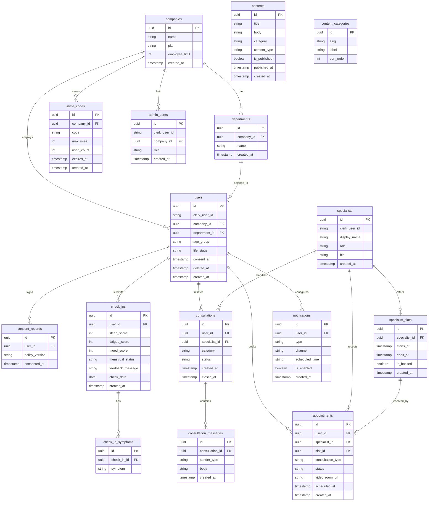

# データベース設計書 — Femcare（仮）

**バージョン:** 1.0.0  
**作成日:** 2026-06-02  
**参照元:** `docs/output/detailed_requirements_specification.md` § 7  
**DB エンジン:** Supabase (PostgreSQL 15+)

---

## 1. 設計方針

| 方針 | 詳細 |
|------|------|
| **個人特定防止** | 従業員の体調データ（`check_ins`・`consultation_messages`）は Row Level Security により、本人以外が直接参照不可。管理者は集計 View 経由のみアクセス可能 |
| **匿名化集計** | ダッシュボード用の集計 View は 5 名未満グループのデータを `NULL` として返し、個人特定を防止 |
| **UUID 主キー** | 全テーブルの主キーは `uuid`（`gen_random_uuid()`）を使用。連番 ID による情報漏洩を防止 |
| **論理削除** | ユーザーデータは原則論理削除（`deleted_at` カラム）を採用し、データ保全・監査ログに対応 |
| **タイムスタンプ** | 全テーブルに `created_at`（`timestamptz DEFAULT now()`）を設ける |

---

## 2. ER 図



---

## 3. テーブル定義

### `companies` — 企業

| カラム名 | データ型 | 制約 | 説明 |
|----------|----------|------|------|
| `id` | `uuid` | PK, DEFAULT `gen_random_uuid()` | 企業識別子 |
| `name` | `text` | NOT NULL | 企業名 |
| `plan` | `text` | NOT NULL, DEFAULT `'lite'` | `'lite'` / `'standard'` / `'premium'` |
| `employee_limit` | `integer` | NOT NULL, DEFAULT `1000` | 招待可能な最大従業員数 |
| `created_at` | `timestamptz` | NOT NULL, DEFAULT `now()` | 登録日時 |

**RLS:** 管理者は自社のレコードのみ SELECT 可能。INSERT / UPDATE は Service Role のみ。

---

### `departments` — 部署

| カラム名 | データ型 | 制約 | 説明 |
|----------|----------|------|------|
| `id` | `uuid` | PK, DEFAULT `gen_random_uuid()` | 部署識別子 |
| `company_id` | `uuid` | NOT NULL, FK → `companies.id` ON DELETE CASCADE | 所属企業 |
| `name` | `text` | NOT NULL | 部署名（例: 営業部） |
| `created_at` | `timestamptz` | NOT NULL, DEFAULT `now()` | 登録日時 |

**インデックス:** `(company_id)`

---

### `invite_codes` — 招待コード

| カラム名 | データ型 | 制約 | 説明 |
|----------|----------|------|------|
| `id` | `uuid` | PK, DEFAULT `gen_random_uuid()` | 識別子 |
| `company_id` | `uuid` | NOT NULL, FK → `companies.id` ON DELETE CASCADE | 発行企業 |
| `code` | `text` | NOT NULL, UNIQUE | ランダム 12 桁英数字 |
| `max_uses` | `integer` | NOT NULL, DEFAULT `0` | 0 = 無制限 |
| `used_count` | `integer` | NOT NULL, DEFAULT `0` | 使用済み回数 |
| `expires_at` | `timestamptz` | NOT NULL | 有効期限（発行から 30 日） |
| `created_at` | `timestamptz` | NOT NULL, DEFAULT `now()` | 発行日時 |

**RLS:** INSERT / UPDATE / SELECT は管理者（自社分のみ）または Service Role。

---

### `users` — 従業員ユーザー

| カラム名 | データ型 | 制約 | 説明 |
|----------|----------|------|------|
| `id` | `uuid` | PK, DEFAULT `gen_random_uuid()` | ユーザー識別子 |
| `clerk_user_id` | `text` | NOT NULL, UNIQUE | Clerk が発行する外部 ID |
| `company_id` | `uuid` | NOT NULL, FK → `companies.id` | 所属企業 |
| `department_id` | `uuid` | FK → `departments.id` | 所属部署（任意） |
| `age_group` | `text` | NOT NULL, CHECK IN (`'20s'`,`'30s'`,`'40s'`,`'50s'`) | 年代 |
| `life_stage` | `text` | NOT NULL, CHECK IN (`'menstrual'`,`'trying_to_conceive'`,`'postpartum'`,`'menopause'`) | ライフステージ |
| `consent_at` | `timestamptz` | NOT NULL | プライバシーポリシー同意日時 |
| `deleted_at` | `timestamptz` | | 退会・削除日時（論理削除） |
| `created_at` | `timestamptz` | NOT NULL, DEFAULT `now()` | 登録日時 |

**RLS ポリシー:**
```sql
-- 本人のみ自分のレコードを参照・更新
CREATE POLICY "users_self" ON users
  USING (auth.jwt() ->> 'sub' = clerk_user_id);
```

**インデックス:** `(clerk_user_id)`, `(company_id)`, `(department_id)`

---

### `admin_users` — 管理者ユーザー（人事担当）

| カラム名 | データ型 | 制約 | 説明 |
|----------|----------|------|------|
| `id` | `uuid` | PK, DEFAULT `gen_random_uuid()` | 識別子 |
| `clerk_user_id` | `text` | NOT NULL, UNIQUE | Clerk ID |
| `company_id` | `uuid` | NOT NULL, FK → `companies.id` | 所属企業 |
| `role` | `text` | NOT NULL, DEFAULT `'viewer'`, CHECK IN (`'admin'`,`'viewer'`) | 権限（admin: 全操作 / viewer: 参照のみ） |
| `created_at` | `timestamptz` | NOT NULL, DEFAULT `now()` | 登録日時 |

---

### `consent_records` — 同意記録

| カラム名 | データ型 | 制約 | 説明 |
|----------|----------|------|------|
| `id` | `uuid` | PK | 識別子 |
| `user_id` | `uuid` | NOT NULL, FK → `users.id` | 同意者 |
| `policy_version` | `text` | NOT NULL | プライバシーポリシーのバージョン（例: `'v1.0'`） |
| `consented_at` | `timestamptz` | NOT NULL, DEFAULT `now()` | 同意日時 |

---

### `check_ins` — 体調チェックイン

| カラム名 | データ型 | 制約 | 説明 |
|----------|----------|------|------|
| `id` | `uuid` | PK, DEFAULT `gen_random_uuid()` | チェックイン識別子 |
| `user_id` | `uuid` | NOT NULL, FK → `users.id` ON DELETE CASCADE | 記録者 |
| `sleep_score` | `smallint` | NOT NULL, CHECK (1 <= value <= 5) | 睡眠の質（1: 非常に悪い 〜 5: 非常に良い） |
| `fatigue_score` | `smallint` | NOT NULL, CHECK (1 <= value <= 5) | 身体の疲れ（1: 非常に疲れている 〜 5: 元気） |
| `mood_score` | `smallint` | NOT NULL, CHECK (1 <= value <= 5) | 気分・メンタル（1: 非常に悪い 〜 5: 非常に良い） |
| `menstrual_status` | `text` | NOT NULL, CHECK IN (`'menstrual'`,`'premenstrual'`,`'normal'`) | 月経状況 |
| `feedback_message` | `text` | | 表示した「今日の気づき」メッセージ（ログ用） |
| `check_date` | `date` | NOT NULL | チェックイン日（YYYY-MM-DD） |
| `created_at` | `timestamptz` | NOT NULL, DEFAULT `now()` | 作成日時 |

**ユニーク制約:** `(user_id, check_date)` — 1 ユーザー / 1 日 1 レコード制約

**RLS ポリシー:**
```sql
CREATE POLICY "checkins_self" ON check_ins
  USING (user_id IN (
    SELECT id FROM users WHERE clerk_user_id = auth.jwt() ->> 'sub'
  ));
```

**インデックス:**
- `(user_id, check_date DESC)` — 履歴参照・集計用
- `(check_date)` — 日次バッチ処理用

---

### `check_in_symptoms` — チェックイン症状記録

| カラム名 | データ型 | 制約 | 説明 |
|----------|----------|------|------|
| `id` | `uuid` | PK, DEFAULT `gen_random_uuid()` | 識別子 |
| `check_in_id` | `uuid` | NOT NULL, FK → `check_ins.id` ON DELETE CASCADE | 対象チェックイン |
| `symptom` | `text` | NOT NULL, CHECK IN (`'headache'`,`'abdominal_pain'`,`'bloating'`,`'hot_flash'`,`'fatigue'`,`'other'`) | 症状コード |

**インデックス:** `(check_in_id)`

---

### `contents` — コンテンツ（記事）

| カラム名 | データ型 | 制約 | 説明 |
|----------|----------|------|------|
| `id` | `uuid` | PK, DEFAULT `gen_random_uuid()` | コンテンツ識別子 |
| `title` | `text` | NOT NULL | 記事タイトル |
| `body` | `text` | NOT NULL | 本文（Markdown 形式） |
| `category` | `text` | NOT NULL, CHECK IN (`'menstrual'`,`'pms'`,`'menopause'`,`'pregnancy'`,`'mental'`) | カテゴリ |
| `content_type` | `text` | NOT NULL, DEFAULT `'article'`, CHECK IN (`'article'`,`'video'`) | 記事 / 動画 |
| `thumbnail_url` | `text` | | サムネイル画像 URL（Supabase Storage） |
| `is_published` | `boolean` | NOT NULL, DEFAULT `false` | 公開フラグ |
| `published_at` | `timestamptz` | | 公開日時 |
| `created_at` | `timestamptz` | NOT NULL, DEFAULT `now()` | 作成日時 |

**インデックス:** `(category, is_published, published_at DESC)`

---

### `specialists` — 医療専門家

| カラム名 | データ型 | 制約 | 説明 |
|----------|----------|------|------|
| `id` | `uuid` | PK, DEFAULT `gen_random_uuid()` | 専門家識別子 |
| `clerk_user_id` | `text` | NOT NULL, UNIQUE | Clerk ID |
| `display_name` | `text` | NOT NULL | 表示名（例: 「看護師 A」）※プライバシー保護 |
| `role` | `text` | NOT NULL, CHECK IN (`'nurse'`,`'midwife'`,`'obgyn'`) | 役職（看護師 / 助産師 / 産婦人科医） |
| `bio` | `text` | | プロフィール紹介文 |
| `created_at` | `timestamptz` | NOT NULL, DEFAULT `now()` | 登録日時 |

---

### `specialist_slots` — 専門家の空き枠

| カラム名 | データ型 | 制約 | 説明 |
|----------|----------|------|------|
| `id` | `uuid` | PK | 枠識別子 |
| `specialist_id` | `uuid` | NOT NULL, FK → `specialists.id` | 担当専門家 |
| `starts_at` | `timestamptz` | NOT NULL | 開始日時 |
| `ends_at` | `timestamptz` | NOT NULL | 終了日時 |
| `is_booked` | `boolean` | NOT NULL, DEFAULT `false` | 予約済みフラグ |
| `created_at` | `timestamptz` | NOT NULL, DEFAULT `now()` | 登録日時 |

**インデックス:** `(specialist_id, starts_at)`, `(starts_at, is_booked)`

---

### `consultations` — 相談スレッド

| カラム名 | データ型 | 制約 | 説明 |
|----------|----------|------|------|
| `id` | `uuid` | PK, DEFAULT `gen_random_uuid()` | 相談識別子 |
| `user_id` | `uuid` | NOT NULL, FK → `users.id` | 相談者 |
| `specialist_id` | `uuid` | FK → `specialists.id` | 担当専門家（アサイン前は NULL） |
| `category` | `text` | NOT NULL, CHECK IN (`'menstrual'`,`'pms'`,`'menopause'`,`'pregnancy'`,`'mental'`,`'other'`) | 相談カテゴリ |
| `status` | `text` | NOT NULL, DEFAULT `'pending'`, CHECK IN (`'pending'`,`'active'`,`'closed'`) | ステータス |
| `created_at` | `timestamptz` | NOT NULL, DEFAULT `now()` | 相談開始日時 |
| `closed_at` | `timestamptz` | | 相談終了日時 |

**RLS ポリシー:**
```sql
-- 従業員: 自分の相談のみ
CREATE POLICY "consultations_employee" ON consultations
  USING (user_id IN (
    SELECT id FROM users WHERE clerk_user_id = auth.jwt() ->> 'sub'
  ));

-- 専門家: 担当相談のみ
CREATE POLICY "consultations_specialist" ON consultations
  USING (specialist_id IN (
    SELECT id FROM specialists WHERE clerk_user_id = auth.jwt() ->> 'sub'
  ));
```

---

### `consultation_messages` — 相談メッセージ

| カラム名 | データ型 | 制約 | 説明 |
|----------|----------|------|------|
| `id` | `uuid` | PK, DEFAULT `gen_random_uuid()` | メッセージ識別子 |
| `consultation_id` | `uuid` | NOT NULL, FK → `consultations.id` ON DELETE CASCADE | 所属スレッド |
| `sender_type` | `text` | NOT NULL, CHECK IN (`'user'`,`'specialist'`,`'system'`) | 送信者種別 |
| `body` | `text` | NOT NULL | メッセージ本文 |
| `created_at` | `timestamptz` | NOT NULL, DEFAULT `now()` | 送信日時 |

**Supabase Realtime:** このテーブルの INSERT イベントをリアルタイム配信に使用。

**インデックス:** `(consultation_id, created_at ASC)`

---

### `appointments` — 医師予約

| カラム名 | データ型 | 制約 | 説明 |
|----------|----------|------|------|
| `id` | `uuid` | PK, DEFAULT `gen_random_uuid()` | 予約識別子 |
| `user_id` | `uuid` | NOT NULL, FK → `users.id` | 予約者 |
| `specialist_id` | `uuid` | NOT NULL, FK → `specialists.id` | 担当専門家 |
| `slot_id` | `uuid` | NOT NULL, UNIQUE, FK → `specialist_slots.id` | 予約枠（1 枠 = 1 予約） |
| `consultation_type` | `text` | NOT NULL, CHECK IN (`'text'`,`'video'`) | 相談形式 |
| `status` | `text` | NOT NULL, DEFAULT `'scheduled'`, CHECK IN (`'scheduled'`,`'completed'`,`'cancelled'`) | ステータス |
| `video_room_url` | `text` | | Daily.co ビデオルーム URL（video のみ） |
| `scheduled_at` | `timestamptz` | NOT NULL | 予約日時 |
| `created_at` | `timestamptz` | NOT NULL, DEFAULT `now()` | 作成日時 |

---

### `notifications` — 通知設定

| カラム名 | データ型 | 制約 | 説明 |
|----------|----------|------|------|
| `id` | `uuid` | PK | 識別子 |
| `user_id` | `uuid` | NOT NULL, FK → `users.id` ON DELETE CASCADE | 対象ユーザー |
| `type` | `text` | NOT NULL, CHECK IN (`'checkin_reminder'`,`'consultation_reply'`) | 通知タイプ |
| `channel` | `text` | NOT NULL, CHECK IN (`'push'`,`'email'`,`'both'`) | 通知チャネル |
| `scheduled_time` | `text` | | リマインダー時刻（HH:MM 形式、例: `'08:00'`） |
| `is_enabled` | `boolean` | NOT NULL, DEFAULT `true` | 有効フラグ |
| `created_at` | `timestamptz` | NOT NULL, DEFAULT `now()` | 作成日時 |

**ユニーク制約:** `(user_id, type)` — ユーザーごとに通知タイプ 1 設定

---

## 4. 匿名集計 View（管理ダッシュボード用）

### 4.1 `department_monthly_summary` View

5 名未満グループのデータは `NULL` を返すことで個人特定を防止する。

```sql
CREATE VIEW department_monthly_summary AS
SELECT
    d.id                                                                          AS department_id,
    d.name                                                                        AS department_name,
    c.id                                                                          AS company_id,
    DATE_TRUNC('month', ci.check_date)::date                                      AS month,
    COUNT(DISTINCT ci.user_id)                                                    AS total_checkins,
    CASE
        WHEN COUNT(DISTINCT ci.user_id) >= 5 THEN ROUND(AVG(ci.mood_score)::numeric, 2)
        ELSE NULL
    END                                                                           AS avg_mood_score,
    CASE
        WHEN COUNT(DISTINCT ci.user_id) >= 5 THEN ROUND(AVG(ci.sleep_score)::numeric, 2)
        ELSE NULL
    END                                                                           AS avg_sleep_score,
    CASE
        WHEN COUNT(DISTINCT ci.user_id) >= 5 THEN ROUND(AVG(ci.fatigue_score)::numeric, 2)
        ELSE NULL
    END                                                                           AS avg_fatigue_score,
    CASE
        WHEN COUNT(DISTINCT ci.user_id) >= 5 THEN COUNT(DISTINCT ci.user_id)
        ELSE NULL
    END                                                                           AS active_users
FROM check_ins ci
JOIN users u ON ci.user_id = u.id AND u.deleted_at IS NULL
JOIN departments d ON u.department_id = d.id
JOIN companies c ON u.company_id = c.id
GROUP BY d.id, d.name, c.id, DATE_TRUNC('month', ci.check_date);
```

### 4.2 `company_monthly_summary` View（全社集計）

```sql
CREATE VIEW company_monthly_summary AS
SELECT
    c.id                                                          AS company_id,
    DATE_TRUNC('month', ci.check_date)::date                      AS month,
    COUNT(DISTINCT ci.user_id)                                    AS active_users,
    ROUND(AVG(ci.mood_score)::numeric, 2)                         AS avg_mood_score,
    ROUND(AVG(ci.sleep_score)::numeric, 2)                        AS avg_sleep_score,
    ROUND(AVG(ci.fatigue_score)::numeric, 2)                      AS avg_fatigue_score
FROM check_ins ci
JOIN users u ON ci.user_id = u.id AND u.deleted_at IS NULL
JOIN companies c ON u.company_id = c.id
GROUP BY c.id, DATE_TRUNC('month', ci.check_date);
```

---

## 5. マイグレーション方針

- **ツール:** Supabase CLI の `supabase migration` を使用
- **管理:** `supabase/migrations/` ディレクトリでバージョン管理
- **本番適用:** GitHub Actions の CI/CD パイプラインから `supabase db push` を実行
- **バックアップ:** マイグレーション前に Supabase ダッシュボードから手動スナップショットを取得

```
supabase/migrations/
├── 20260601000000_initial_schema.sql
├── 20260601000001_rls_policies.sql
├── 20260601000002_aggregate_views.sql
└── 20260601000003_indexes.sql
```
