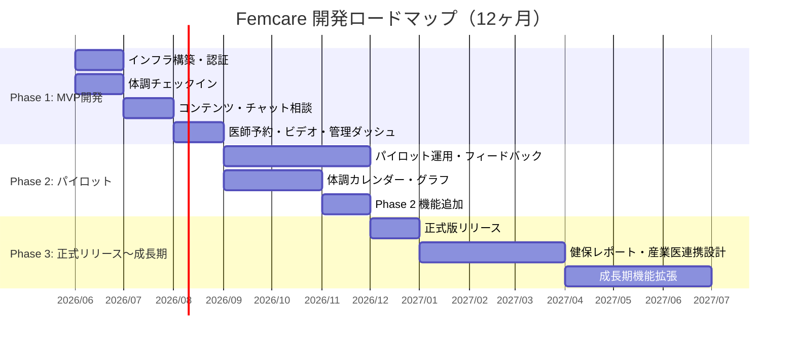

# 開発計画書 — Femcare（仮）

**バージョン:** 1.0.0  
**作成日:** 2026-06-02  
**参照元:** `docs/output/detailed_requirements_specification.md` § 3.3, § 8, § 10

---

## 1. 開発ロードマップ



### 1.1 フェーズ別目標

| フェーズ | 期間 | 主目標 | 成功指標 |
|----------|------|--------|---------|
| **Phase 1: MVP 開発** | 0〜3 ヶ月目 | パイロット導入可能な MVP をリリース | 全コア機能の動作確認・パイロット企業 1 社での受け入れテスト通過 |
| **Phase 2: パイロット** | 3〜9 ヶ月目 | パイロット 3 社・300 名での仮説検証と改善 | MAU 50% 以上・企業継続意向 80% 以上 |
| **Phase 3: 正式リリース** | 9〜12 ヶ月目 | 正式版リリース・導入企業 5 社達成 | MAU 60% 以上・NPS（従業員）40 以上 |
| **Phase 4: 成長期** | 12 ヶ月目〜 | 導入企業 10 社・ARR 1 億円 | ARR 1 億円・リテンション 90% 以上 |

---

## 2. 開発プロセス

### 2.1 開発モデル

**アジャイル / イテレーティブ開発**

- MVP 開発では 2 週間スプリントを採用
- スプリントごとにデモ → フィードバック → 優先度見直しのサイクルを回す
- パイロット期間（Phase 2）は週次インタビューの結果を次スプリントに即時反映

### 2.2 ブランチ戦略

```
main ─────────────────────────────────── (本番デプロイ)
  └── develop ──────────────────────────  (開発統合)
        ├── feature/checkin-form
        ├── feature/chat-consultation
        └── feature/admin-dashboard
```

- `feature/xxx` → Pull Request → コードレビュー（1 名以上） → `develop` へマージ
- リリース時: `develop` → `main` へマージ → Vercel 自動デプロイ

### 2.3 品質管理

| 項目 | 方針 |
|------|------|
| 単体テスト | Jest + React Testing Library。MVP フェーズではコア機能（チェックイン送信・匿名化ロジック）に限定 |
| E2E テスト | Playwright。主要ユーザーフロー（招待登録 → チェックイン → 気づき表示）を Phase 2 から整備 |
| 型チェック | `tsc --noEmit` を CI に組み込み。型エラーゼロを維持 |
| Lint | ESLint + Prettier。PR 時に自動チェック |
| セキュリティ | Dependabot で依存パッケージの脆弱性を自動監視 |

### 2.4 スケジュール

| フェーズ | 期間 | 主なタスク |
|----------|------|----------|
| 要件定義・設計 | 〜 2026/06 | 本ドキュメント群の完成・DB スキーマ確定 |
| Phase 1: MVP 実装 | 2026/06〜08 | 下記 WBS 参照 |
| Phase 1: 受け入れテスト | 2026/09 | パイロット企業 1 社との受け入れテスト |
| Phase 2: パイロット | 2026/09〜12 | 試験運用・UX 改善・フィードバック反映 |
| Phase 3: 正式リリース | 2026/12〜 | 改善版リリース・営業本格化 |

---

## 3. タスク分解（WBS）— Phase 1 MVP

### 3.1 環境構築・インフラ（1 ヶ月目前半）

| タスク ID | タスク名 | 優先度 | 工数目安 |
|----------|---------|--------|---------|
| T-001 | GitHub リポジトリ作成・ブランチ戦略設定 | 最高 | 0.5 日 |
| T-002 | Next.js プロジェクト初期化（TypeScript・Tailwind・shadcn/ui） | 最高 | 1 日 |
| T-003 | Vercel プロジェクト作成・自動デプロイ設定 | 最高 | 0.5 日 |
| T-004 | Supabase プロジェクト作成・DB スキーマ初期マイグレーション | 最高 | 2 日 |
| T-005 | Supabase RLS ポリシー設定（全テーブル） | 最高 | 2 日 |
| T-006 | Clerk セットアップ・Supabase JWT 統合 | 最高 | 1 日 |
| T-007 | 環境変数設定（ローカル / Vercel Preview / 本番） | 最高 | 0.5 日 |
| T-008 | Sentry / Vercel Analytics 導入 | 高 | 0.5 日 |

### 3.2 認証・オンボーディング（1 ヶ月目後半）

| タスク ID | タスク名 | 優先度 | 工数目安 |
|----------|---------|--------|---------|
| T-010 | 招待コード検証 API（`POST /api/auth/validate-invite`） | 最高 | 1 日 |
| T-011 | 招待コード登録画面（S-01）実装 | 最高 | 2 日 |
| T-012 | プロフィール設定画面（S-02）実装 | 最高 | 1 日 |
| T-013 | プライバシー同意フロー（S-03）実装 | 最高 | 1 日 |
| T-014 | Clerk Webhook 受信・`users` テーブル同期 | 最高 | 1 日 |
| T-015 | ログイン・セッション管理（Clerk 提供 UI を活用） | 最高 | 0.5 日 |

### 3.3 体調チェックイン（1〜2 ヶ月目）

| タスク ID | タスク名 | 優先度 | 工数目安 |
|----------|---------|--------|---------|
| T-020 | チェックイン送信 API（`POST /api/checkins`）実装 | 最高 | 2 日 |
| T-021 | フィードバックメッセージ選択ロジック実装（テンプレート 20〜30 種） | 最高 | 3 日 |
| T-022 | チェックインフォーム（S-05）— 5 ステップ式 UI 実装（CC） | 最高 | 3 日 |
| T-023 | 気づき表示画面（S-06）実装（SC） | 最高 | 1 日 |
| T-024 | ホーム画面（S-04）実装（SC） | 最高 | 2 日 |
| T-025 | チェックイン状態確認 API（`GET /api/checkins/today`）実装 | 最高 | 0.5 日 |
| T-026 | Service Worker 実装（Web Push 購読・受信） | 高 | 2 日 |
| T-027 | チェックインリマインダー送信バッチ実装（Resend メール） | 高 | 2 日 |

### 3.4 コンテンツ機能（2 ヶ月目）

| タスク ID | タスク名 | 優先度 | 工数目安 |
|----------|---------|--------|---------|
| T-030 | コンテンツ一覧 API（`GET /api/contents`）実装 | 最高 | 1 日 |
| T-031 | コンテンツ詳細 API（`GET /api/contents/:id`）実装 | 最高 | 0.5 日 |
| T-032 | コンテンツ一覧画面（S-07）実装（SC） | 最高 | 2 日 |
| T-033 | コンテンツ詳細画面（S-08）実装（SC） | 最高 | 1.5 日 |
| T-034 | レコメンドコンテンツ API（`GET /api/contents/recommended`）実装 | 高 | 1 日 |
| T-035 | 初期コンテンツデータ投入（専門家監修済み記事 10 件以上） | 高 | 外部依存 |

### 3.5 専門家相談（2 ヶ月目）

| タスク ID | タスク名 | 優先度 | 工数目安 |
|----------|---------|--------|---------|
| T-040 | 相談スレッド作成 API（`POST /api/consultations`）実装 | 最高 | 1.5 日 |
| T-041 | メッセージ送信 API（`POST /api/consultations/:id/messages`）実装 | 最高 | 1 日 |
| T-042 | Supabase Realtime チャンネル設定（`consultation_messages`） | 最高 | 1 日 |
| T-043 | 相談 TOP 画面（S-09）実装 | 最高 | 0.5 日 |
| T-044 | チャット相談画面（S-10）CC 実装（Realtime 購読込み） | 最高 | 3 日 |
| T-045 | 専門家側管理画面（相談一覧・チャット返信）実装 | 最高 | 3 日 |
| T-046 | 相談返信通知（Web Push / メール）実装 | 高 | 1.5 日 |

### 3.6 医師予約・ビデオ相談（3 ヶ月目前半）

| タスク ID | タスク名 | 優先度 | 工数目安 |
|----------|---------|--------|---------|
| T-050 | 空き枠一覧 API（`GET /api/specialists/slots`）実装 | 最高 | 1 日 |
| T-051 | 予約作成 API（`POST /api/appointments`）実装 | 最高 | 1.5 日 |
| T-052 | 医師相談予約画面（S-11）CC 実装（カレンダー UI） | 最高 | 2.5 日 |
| T-053 | Daily.co API 統合（ビデオルーム作成 API）実装 | 最高 | 2 日 |
| T-054 | ビデオ相談画面（S-12）CC 実装（Daily.co SDK） | 最高 | 2.5 日 |

### 3.7 管理ダッシュボード（3 ヶ月目）

| タスク ID | タスク名 | 優先度 | 工数目安 |
|----------|---------|--------|---------|
| T-060 | 管理者認証・権限分岐実装（Clerk 組織管理活用） | 最高 | 1 日 |
| T-061 | 匿名集計 View 作成（`department_monthly_summary` 等） | 最高 | 2 日 |
| T-062 | ダッシュボードサマリー API（`GET /api/admin/dashboard/summary`）実装 | 最高 | 2 日 |
| T-063 | サマリーダッシュボード画面（D-02）SC + TrendChart CC 実装 | 最高 | 3 日 |
| T-064 | 従業員一括招待 API（`POST /api/admin/employees/invite`）実装 | 最高 | 2 日 |
| T-065 | 従業員管理画面（D-05）CC 実装（CSV インポート） | 最高 | 2 日 |
| T-066 | 月次レポート PDF 生成 API・@react-pdf/renderer 実装 | 最高 | 3 日 |
| T-067 | 健康経営優良法人認定用データ出力実装（経産省フォーマット） | 最高 | 2 日 |
| T-068 | レポート出力画面（D-04）CC 実装 | 最高 | 1 日 |

### 3.8 テスト・受け入れ準備（3 ヶ月目後半）

| タスク ID | タスク名 | 優先度 | 工数目安 |
|----------|---------|--------|---------|
| T-070 | チェックイン送信・匿名化ロジックの単体テスト実装 | 高 | 2 日 |
| T-071 | 招待登録 → チェックイン → 気づき表示の E2E テスト実装（Playwright） | 高 | 2 日 |
| T-072 | セキュリティレビュー（RLS ポリシーの動作確認・JWT 検証） | 最高 | 1.5 日 |
| T-073 | パフォーマンス計測（Lighthouse / Vercel Analytics でチェックイン画面 LCP 確認） | 高 | 0.5 日 |
| T-074 | パイロット企業との受け入れテスト実施 | 最高 | 3 日 |
| T-075 | バグ修正・フィードバック対応 | 最高 | 3 日 |

---

## 4. Phase 2〜4 機能追加計画

### Phase 2 追加機能（3〜9 ヶ月目）

| 機能 | 概要 | タスク数目安 |
|------|------|------------|
| 体調カレンダー・グラフ（F-021） | 月間カレンダー表示・推移グラフ | 5 日 |
| 月経周期トラッキング（F-022） | 周期予測・記録 | 4 日 |
| 短動画コンテンツ（F-023） | Supabase Storage に動画を格納・プレーヤー UI | 5 日 |
| 休職・離職リスクアラート（F-024） | 匿名集計ベースのアラート機能 | 4 日 |
| 体調データ事前共有（F-025） | 相談時の体調履歴自動連携（ユーザー許可制） | 3 日 |
| 相談履歴・メモ保存（F-026） | 相談アーカイブ閲覧 | 2 日 |
| 症状トレンド（ダッシュボード） | 集計された症状トレンド表示 | 3 日 |
| 健保提出用レポート | 健保組合向けフォーマット対応 | 3 日 |

### Phase 3〜4 追加機能（9 ヶ月目〜）

| 機能 | 対応時期 |
|------|---------|
| コンテンツ検索（F-030） | Phase 3 |
| カスタムレポート（F-031） | Phase 3 |
| 産業医連携機能（F-029） | Phase 3〜4 |
| ネイティブアプリ化（iOS/Android） | Phase 4 以降（要検討） |
| 多言語対応 | Phase 4 以降（要検討） |

---

## 5. リスク管理

### 5.1 リスク一覧と対応策

| No | リスク内容 | 影響度 | 発生確率 | 対応策 |
|----|-----------|--------|---------|--------|
| R1 | 医師法・薬機法への抵触 | 最高 | 低 | 弁護士・医師監修のもと「相談」と「診療」の線引きを明文化。チャット返信ガイドライン策定（MVP リリース前必須） |
| R2 | 個人情報保護法違反 | 最高 | 低 | Supabase RLS + 集計 View による技術的制御。プライバシーポリシー整備・同意記録保存。セキュリティレビュー（T-072）で検証 |
| R3 | 従業員チェックインの継続率低下 | 高 | 中 | 通知設計・フィードバック UX に注力（T-026・T-027）。「責めない」通知文言の徹底。初月継続率を重点 KPI に設定 |
| R4 | 専門家ネットワーク確保難航 | 高 | 中 | MVP リリースの絶対前提条件として専門家確保を優先（T-040 着手前に解決必須）。既存オンライン医療プラットフォームとの提携を先行検討 |
| R5 | 企業プライバシー懸念による導入拒否 | 高 | 中 | 匿名化の仕組みを契約前に技術説明。第三者セキュリティ審査の取得を検討 |
| R6 | ビデオ通話の品質・安定性 | 高 | 中 | Daily.co マネージドSDK 採用（T-053）。MVP ではテキスト相談を主軸にビデオは補完的位置づけ |
| R7 | Clerk / Supabase 等 SaaS の仕様変更 | 中 | 低 | 主要 SaaS の変更ログを定期モニタリング（月次）。API バージョン固定 |
| R8 | 競合の大手参入 | 中 | 中 | 専門家ネットワークと企業導入実績（Moat）の早期構築。一気通貫体験の差別化維持 |
| R9 | Web Push の到達率の低さ | 中 | 高 | メール通知を必ず併用（T-027）。Push 非対応環境でも継続利用できる UX 設計 |
| R10 | 開発工数超過・スケジュール遅延 | 中 | 中 | 週次スプリントレビューで進捗確認。スコープ縮小の判断基準を事前に決定。医師予約・ビデオ通話は MVP から除外できる最終候補として管理 |

### 5.2 撤退・スコープ縮小判断基準

| 条件 | 対応 |
|------|------|
| パイロット開始 1 ヶ月後にアクティブ率 30% 未満 | UX 改善に集中。Phase 2 機能追加を停止して改善に注力 |
| パイロット終了後に企業継続意向 80% 未満 | ビジネスモデル・価格設計の見直し |
| 専門家ネットワークが MVP リリース前に確保できない | ビデオ相談を MVP スコープから除外してリリース時期を死守 |
| 開発工数が見積もりの 150% を超過 | 管理ダッシュボードの PDF 出力を最低限（月次レポートのみ）に絞ってリリース |

---

## 6. 開発環境・ツール

| カテゴリ | ツール |
|----------|--------|
| エディタ | Cursor（AI 支援開発）/ VS Code |
| バージョン管理 | GitHub |
| タスク管理 | GitHub Issues + Projects |
| コミュニケーション | Slack |
| デザイン | Figma（ワイヤーフレーム・デザインカンプ） |
| API テスト | Bruno / Postman |
| DB クライアント | Supabase Studio（ブラウザ） |
| CI | GitHub Actions |
| CD | Vercel（自動デプロイ） |
