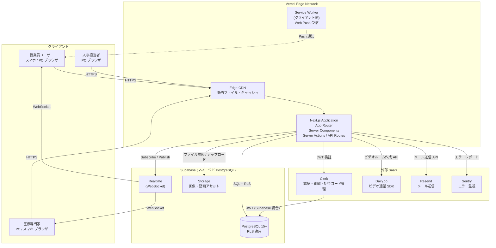
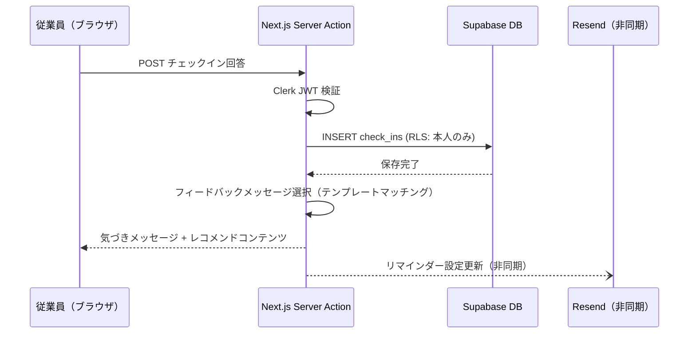
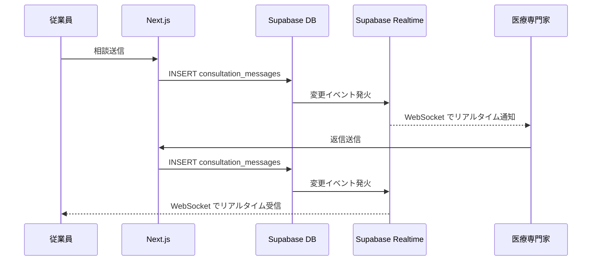
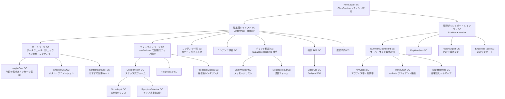
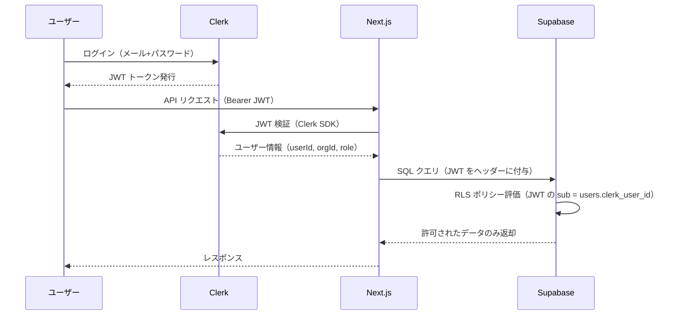

# システムアーキテクチャ設計書 — Femcare（仮）

**バージョン:** 1.0.0  
**作成日:** 2026-06-02  
**参照元:** `docs/output/detailed_requirements_specification.md` § 9

---

## 1. 技術スタック

### 1.1 採用技術一覧

| レイヤー | 技術 | バージョン目安 | 選定理由 |
|----------|------|--------------|---------|
| フロントエンド | **Next.js (App Router)** | 14+ | SSR/SSG ハイブリッドによる初期表示高速化（LCP 1 秒以内の要件を満たす）。Server Components でデータフェッチを最適化し、クライアント JS バンドルを最小化 |
| 言語 | **TypeScript** | 5.x | 医療データを扱う上での型安全性確保。チーム開発での保守性向上。API レスポンスの型定義による信頼性担保 |
| スタイリング | **Tailwind CSS + shadcn/ui** | Tailwind 3.x | ユーティリティファーストで高速実装。shadcn/ui はアクセシビリティ対応済みのヘッドレスコンポーネントを提供し、デザインシステムとの統合が容易 |
| バックエンド | **Next.js App Router (Server Actions / Route Handlers)** | 14+ | フロントエンドと同一リポジトリで管理。サーバーレス関数として Vercel にデプロイ。コロケーションによる開発効率向上 |
| データベース | **Supabase (PostgreSQL 15+)** | - | Row Level Security (RLS) による行レベルアクセス制御が「個人特定防止」要件に直結。Realtime 機能でチャット相談のリアルタイム更新を実現。マネージドサービスによる運用コスト削減 |
| 認証 | **Clerk** | - | 招待コードベースの B2B ユーザー管理・組織管理機能が標準搭載。多要素認証対応。Supabase との JWT 統合が容易 |
| ホスティング | **Vercel** | - | Next.js との親和性が最高。エッジキャッシュによる国内ユーザーへの高速配信。プレビューデプロイによる開発効率向上 |
| ビデオ通話 | **Daily.co SDK** | - | マネージドなビデオ通話 SDK。HIPAA 準拠オプションあり。産婦人科医オンライン相談に使用 |
| PDF 生成 | **@react-pdf/renderer** | - | React コンポーネントベースで PDF を生成。月次レポート・健康経営認定用データの出力に使用 |
| メール送信 | **Resend** | - | シンプルな API でメール送信。チェックインリマインダー・相談返信通知に使用。月 3,000 通まで無料 |
| Push 通知 | **Web Push API + Service Worker** | - | ネイティブアプリなしでブラウザ Push 通知を実現。iOS Safari は Web Push 対応状況を考慮し、メール通知と併用 |
| エラー監視 | **Sentry** | - | エラートラッキング・パフォーマンス監視。Server/Client 両方に対応 |
| アナリティクス | **Vercel Analytics** | - | LCP・Web Vitals 等のパフォーマンス指標をリアルタイム計測 |
| CI/CD | **GitHub Actions + Vercel 自動デプロイ** | - | `main` ブランチへのマージで自動デプロイ。PR ごとのプレビュー環境を自動生成 |

### 1.2 技術選定の補足（代替案との比較）

| 観点 | 採用 | 不採用 | 採用理由 |
|------|------|--------|---------|
| BaaS | Supabase | Firebase | PostgreSQL の Row Level Security が個人特定防止要件に技術的に合致。Firebase の Firestore は行レベルの細粒度制御が難しい |
| フレームワーク | Next.js | Remix | エコシステムの成熟度と Vercel との統合による開発効率を優先 |
| 認証 | Clerk | NextAuth | 招待コードベースの B2B ユーザー管理・組織管理が標準搭載。開発工数を大幅削減 |
| スタイリング | Tailwind + shadcn/ui | CSS Modules / MUI | ユーティリティファーストの高速実装とカスタムデザインシステムの両立 |

---

## 2. アーキテクチャ概要

### 2.1 システム構成図



### 2.2 各コンポーネントの役割

| コンポーネント | 役割 |
|--------------|------|
| **Vercel Edge CDN** | 静的ファイル（HTML/CSS/JS/画像）をエッジキャッシュから高速配信。Next.js の ISR キャッシュも管理 |
| **Next.js App Router** | Server Components でサーバーサイドデータフェッチ＋初期レンダリング。Server Actions でフォーム送信・DB 書き込みを処理。API Routes で外部 SaaS との連携エンドポイントを提供 |
| **Supabase PostgreSQL** | メインデータストア。RLS ポリシーにより従業員・管理者・専門家のデータアクセスを行レベルで分離。集計 View 経由でのみ管理者が匿名データを参照可能 |
| **Supabase Realtime** | チャット相談のリアルタイムメッセージ配信（WebSocket）。医療専門家への新規相談通知にも使用 |
| **Clerk** | 招待コードベースの認証・B2B 組織管理。JWT を発行し Supabase の RLS と統合。従業員・管理者・専門家の権限分離を担う |
| **Daily.co** | 産婦人科医とのビデオ通話 SDK。Next.js Server Action でルーム作成 → クライアント側 SDK でビデオ通話を開始 |
| **Service Worker** | ブラウザのバックグラウンドで動作。Web Push 通知（チェックインリマインダー・相談返信通知）を受信 |

### 2.3 データフロー概要

#### チェックイン送信フロー



#### チャット相談リアルタイムフロー



---

## 3. コンポーネント設計

### 3.1 ディレクトリ構成（推奨）

```
src/
├── app/                          # Next.js App Router
│   ├── (auth)/                   # 認証グループ（ログイン・招待登録）
│   │   ├── invite/page.tsx       # 招待コード登録
│   │   └── login/page.tsx        # ログイン
│   ├── (employee)/               # 従業員アプリ グループ
│   │   ├── layout.tsx            # 共通レイアウト（ボトムナビ）SC
│   │   ├── home/page.tsx         # ホーム SC
│   │   ├── checkin/page.tsx      # チェックイン CC
│   │   ├── contents/             # コンテンツ
│   │   │   ├── page.tsx          # 一覧 SC
│   │   │   └── [id]/page.tsx     # 詳細 SC
│   │   ├── consultation/         # 相談
│   │   │   ├── page.tsx          # 相談 TOP SC
│   │   │   ├── chat/[id]/page.tsx # チャット CC
│   │   │   └── appointment/page.tsx # 医師予約 CC
│   │   └── settings/page.tsx     # 設定 CC
│   ├── (admin)/                  # 管理ダッシュボード グループ
│   │   ├── layout.tsx            # 管理画面共通レイアウト SC
│   │   ├── dashboard/page.tsx    # サマリー SC
│   │   ├── departments/page.tsx  # 部署別分析 SC
│   │   ├── reports/page.tsx      # レポート出力 CC
│   │   └── employees/page.tsx    # 従業員管理 CC
│   └── api/                      # Route Handlers
│       ├── checkins/route.ts
│       ├── consultations/route.ts
│       ├── admin/
│       │   ├── dashboard/route.ts
│       │   └── reports/route.ts
│       └── webhooks/clerk/route.ts
├── components/
│   ├── ui/                       # shadcn/ui ベースコンポーネント
│   ├── employee/                 # 従業員アプリ専用コンポーネント
│   │   ├── CheckInForm.tsx       # CC
│   │   ├── InsightCard.tsx       # SC
│   │   ├── ChatWindow.tsx        # CC
│   │   └── VideoCall.tsx         # CC
│   └── admin/                    # 管理ダッシュボード専用コンポーネント
│       ├── SummaryDashboard.tsx  # SC
│       ├── TrendChart.tsx        # CC
│       └── ReportExport.tsx      # CC
├── lib/
│   ├── supabase/
│   │   ├── server.ts             # Supabase Server Client
│   │   └── client.ts             # Supabase Browser Client
│   ├── clerk.ts                  # Clerk ヘルパー
│   └── feedback.ts               # フィードバックメッセージ選択ロジック
├── actions/                      # Server Actions
│   ├── checkin.ts
│   ├── consultation.ts
│   └── report.ts
└── types/                        # TypeScript 型定義
    ├── database.ts               # Supabase 自動生成型
    └── api.ts                    # API リクエスト / レスポンス型
```

### 3.2 コンポーネント階層図



### 3.3 主要コンポーネント設計

#### `CheckInForm`（Client Component）

```typescript
// src/components/employee/CheckInForm.tsx
'use client';

import { useReducer, useTransition } from 'react';
import { submitCheckin } from '@/actions/checkin';

// --- 型定義 ---
export interface CheckInFormProps {
  userId: string;
  todayDate: string;       // サーバーから渡す（タイムゾーン対応）
  onComplete: (result: CheckInResult) => void;
}

type CheckInAnswers = {
  sleep_score?: 1 | 2 | 3 | 4 | 5;
  fatigue_score?: 1 | 2 | 3 | 4 | 5;
  mood_score?: 1 | 2 | 3 | 4 | 5;
  symptoms: string[];
  menstrual_status?: 'menstrual' | 'premenstrual' | 'normal';
};

type CheckInState = {
  step: 1 | 2 | 3 | 4 | 5;
  answers: CheckInAnswers;
  isSubmitting: boolean;
  error: string | null;
};

type CheckInAction =
  | { type: 'SET_SCORE'; field: keyof Omit<CheckInAnswers, 'symptoms' | 'menstrual_status'>; value: 1 | 2 | 3 | 4 | 5 }
  | { type: 'TOGGLE_SYMPTOM'; symptom: string }
  | { type: 'SET_MENSTRUAL'; status: 'menstrual' | 'premenstrual' | 'normal' }
  | { type: 'NEXT_STEP' }
  | { type: 'SET_SUBMITTING'; value: boolean }
  | { type: 'SET_ERROR'; message: string };

// --- 状態管理: useReducer ---
function reducer(state: CheckInState, action: CheckInAction): CheckInState {
  switch (action.type) {
    case 'SET_SCORE':
      return { ...state, answers: { ...state.answers, [action.field]: action.value } };
    case 'TOGGLE_SYMPTOM': {
      const symptoms = state.answers.symptoms.includes(action.symptom)
        ? state.answers.symptoms.filter(s => s !== action.symptom)
        : [...state.answers.symptoms, action.symptom];
      return { ...state, answers: { ...state.answers, symptoms } };
    }
    case 'SET_MENSTRUAL':
      return { ...state, answers: { ...state.answers, menstrual_status: action.status } };
    case 'NEXT_STEP':
      return { ...state, step: Math.min(state.step + 1, 5) as CheckInState['step'] };
    case 'SET_SUBMITTING':
      return { ...state, isSubmitting: action.value };
    case 'SET_ERROR':
      return { ...state, isSubmitting: false, error: action.message };
    default:
      return state;
  }
}

// --- コンポーネント本体 ---
// useTransition で Server Action を非同期実行（送信中は UI をインタラクティブに保つ）
// 送信完了後 onComplete コールバックで親に結果を通知
```

---

#### `ChatWindow`（Client Component）

```typescript
// src/components/employee/ChatWindow.tsx
'use client';

import { useState, useEffect, useRef } from 'react';
import { createClient } from '@/lib/supabase/client';

export interface ChatWindowProps {
  consultationId: string;
  currentUserId: string;
  userType: 'employee' | 'specialist';
}

// 状態管理: useState（messages 配列）
// - Supabase Realtime でチャンネル購読
// - 新メッセージを messages に append（楽観的 UI 更新）
// - useRef で最新メッセージへの自動スクロール
// - 専門家側: userType === 'specialist' で送信者識別
```

---

#### `SummaryDashboard`（Server Component）

```typescript
// src/app/(admin)/dashboard/page.tsx
// Server Component: キャッシュ制御 revalidate 3600秒

import { createServerClient } from '@/lib/supabase/server';

// - Supabase Server Client（Cookie ベース認証）で集計 View を直接クエリ
// - 個人データテーブルへのアクセスは RLS で禁止（集計 View 経由のみ）
// - TrendChart / DeptHeatmap は 'use client' の子コンポーネントとして import
// - ReportExport（PDF 出力ボタン）は Server Action をトリガーする CC

export default async function DashboardPage({ searchParams }) {
  const supabase = createServerClient();
  const month = searchParams?.month ?? getCurrentMonth();
  const summary = await supabase
    .from('department_monthly_summary')
    .select('*')
    .eq('month', month);
  // ... データを子コンポーネントに Props で渡す
}
```

---

## 4. セキュリティアーキテクチャ

### 4.1 認証・認可フロー



### 4.2 Row Level Security（RLS）ポリシー設計方針

| テーブル | 従業員の権限 | 管理者の権限 | 専門家の権限 |
|----------|------------|------------|------------|
| `users` | 自分のレコードのみ SELECT / UPDATE | 参照不可（直接） | 参照不可 |
| `check_ins` | 自分のレコードのみ全操作 | 参照不可（集計 View 経由のみ） | 参照不可 |
| `consultation_messages` | 自分の相談のみ SELECT / INSERT | 参照不可 | 担当相談のみ SELECT / INSERT |
| `department_monthly_summary` (View) | 参照不可 | 所属企業のデータのみ SELECT | 参照不可 |
| `contents` | SELECT のみ（公開コンテンツ） | SELECT のみ | SELECT のみ |

### 4.3 環境変数管理

```bash
# .env.local（ローカル開発）/ Vercel Environment Variables（本番）
NEXT_PUBLIC_CLERK_PUBLISHABLE_KEY=pk_...
CLERK_SECRET_KEY=sk_...
NEXT_PUBLIC_SUPABASE_URL=https://xxx.supabase.co
NEXT_PUBLIC_SUPABASE_ANON_KEY=eyJ...
SUPABASE_SERVICE_ROLE_KEY=eyJ...    # サーバーサイドのみ使用
DAILY_API_KEY=...
RESEND_API_KEY=re_...
SENTRY_DSN=https://...
```

> **注意:** `SUPABASE_SERVICE_ROLE_KEY` は RLS をバイパスするため、サーバーサイド（Server Action / API Route）のみで使用し、クライアントに公開しないこと。

---

## 5. スケーラビリティ設計

### 5.1 フェーズ別インフラ計画

| フェーズ | 規模 | Vercel | Supabase | 月額概算 |
|----------|------|--------|----------|---------|
| MVP（〜3ヶ月目） | 1〜3 社・300 名 | Pro | Pro ($25) | ¥15,000〜30,000 |
| パイロット（〜9ヶ月目） | 5 社・2,000 名 | Pro | Pro | ¥30,000〜60,000 |
| 成長期（〜12ヶ月目） | 10 社・10,000 名 | Pro/Enterprise | Business ($599) | ¥100,000〜 |
| 将来 | 50 社以上 | Enterprise | Enterprise | 要見積もり |

### 5.2 パフォーマンス最適化方針

- **Next.js:** 静的生成可能なコンテンツ（記事一覧・詳細）は ISR（Incremental Static Regeneration）で配信（revalidate: 3600秒）
- **Supabase:** 集計クエリには PostgreSQL のマテリアライズドビューを検討（Phase 2 以降）。接続プーリングは Supabase PgBouncer を活用
- **キャッシュ:** Vercel Edge Cache + Next.js `unstable_cache` で API レスポンスをキャッシュ
- **画像:** Next.js `<Image>` コンポーネントによる自動 WebP 変換・遅延読み込み
