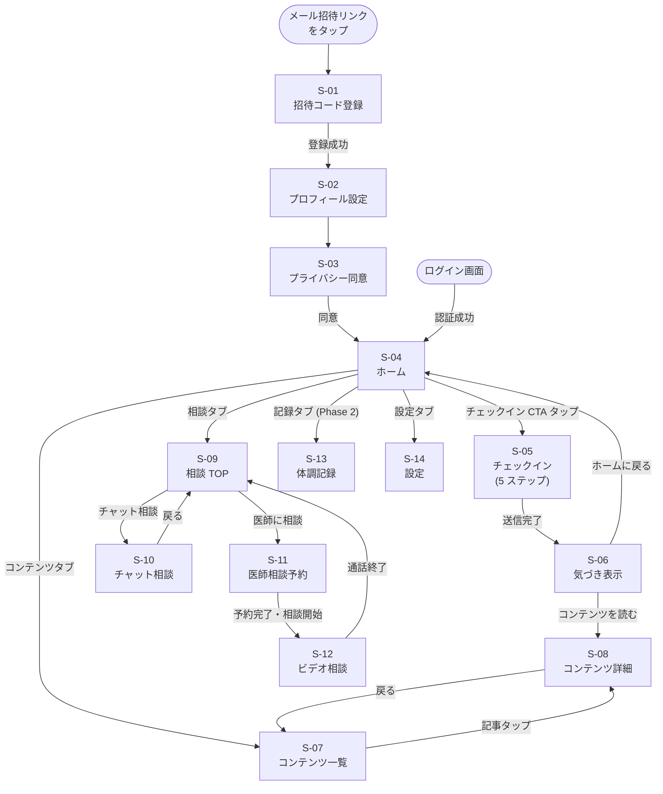
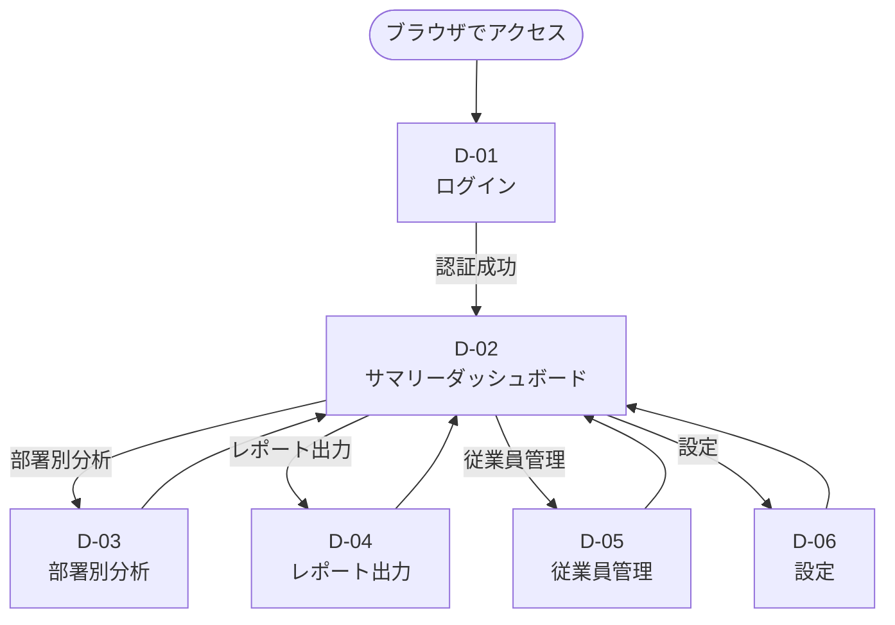

# UI/UX 設計書 — Femcare（仮）

**バージョン:** 1.0.0  
**作成日:** 2026-06-02  
**参照元:** `docs/output/detailed_requirements_specification.md` § 5

---

## 1. デザインコンセプト

### 1.1 テーマ

**「やさしい、プロフェッショナル」**

医療・健康という繊細なテーマを扱うため、清潔感・信頼感を保ちながらも、「病院のような堅さ」ではなく、女性が毎日使いたくなる温かみのある雰囲気にする。

### 1.2 デザインキーワード

| キーワード | 具体的な表現 |
|-----------|------------|
| **安心感** | 「あなたのデータは会社に見えません」の安心バッジを随所に表示。相談画面は特に温かみを強調 |
| **シンプル** | 機能が多くても毎日使う「チェックイン → 気づき → コンテンツ」の導線は一直線。最大 3 タップで到達 |
| **温かみ** | ダスティローズを基調に、やわらかい色調。冷たい感じのする青や無機質なグレーを避ける |
| **信頼** | 医師・専門家が関わっていることを示す監修バッジ。プロフェッショナルなレイアウト・余白 |
| **継続性** | チェックイン完了時の達成感（アニメーション・ポジティブメッセージ）。「責めない」通知設計 |

### 1.3 参考サービス

| サービス | 参考にする点 |
|----------|------------|
| [Notion](https://www.notion.so) | シンプルで整理されたレイアウト・余白の使い方 |
| [Flo（月経管理アプリ）](https://flo.health) | 女性健康アプリの情報設計・グラフ表示 |
| [Calm](https://www.calm.com) | 体験の温かみ・通知・フィードバックのトーン |
| [Stripe](https://stripe.com) | 清潔感のあるプロフェッショナルな UI |

### 1.4 避けたい UX・表現

| 避けたいこと | 代わりに |
|------------|---------|
| 「健康診断」感（数値・スコアの前面表示） | 気づき・メッセージ形式で伝える |
| 過剰な通知・催促（「今日もチェックしてください！」） | 柔らかいトーンで「今日はどんな体調ですか？」 |
| 医療用語の多用（「黄体期」「排卵日」） | 平易な言葉（「月経前の時期」「排卵のタイミング」） |
| 注射・赤十字等の過剰な医療アイコン | 温かみのあるラインアイコン（Lucide Icons） |
| 管理される感覚 | 自分を知る、気づく体験として設計 |

---

## 2. デザインシステム

### 2.1 カラーパレット

```
Primary:       ████  #C97A72  ダスティローズ  メインボタン・アクティブ・ブランドカラー
Primary Light: ████  #F2E0DE  ライトローズ    背景ハイライト・カード背景
Accent:        ████  #4A7C6F  セージグリーン  サブアクション・完了状態
Accent Light:  ████  #DCF0EB  ライトセージ    タグ・バッジ背景
Background:    ████  #FAF8F5  ウォームホワイト アプリ全体背景
Surface:       ████  #FFFFFF  ホワイト        カード・モーダル背景
Text Primary:  ████  #2D2D2D  チャコール      見出し・本文
Text Secondary:████  #6B6B6B  ミディアムグレー サブテキスト・キャプション
Border:        ████  #E5E2DF  ライトグレー    区切り線・ボーダー
Medical:       ████  #EEF3F7  クールブルー    相談・医療セクション背景
Error:         ████  #D95B4A  ウォームレッド  エラー表示
Warning:       ████  #E8A87C  アンバー        注意・アラート
Success:       ████  #6BAB8F  ソフトグリーン  完了・ポジティブフィードバック
```

**カラー使用ルール:**
- Primary（`#C97A72`）は主要 CTA ボタンのみ使用。テキストには使用しない（コントラスト比確保のため）
- 相談・医療系画面では `Medical`（`#EEF3F7`）を背景に使い、「医療的な場所」を演出しつつ温かみを保つ
- ダークモードは MVP 対象外。Phase 2 で検討

### 2.2 タイポグラフィ

#### フォント設定

```css
/* Google Fonts / システムフォント */
--font-ja: 'Noto Sans JP', 'Hiragino Sans', 'Yu Gothic', sans-serif;
--font-en: 'Inter', sans-serif;

/* 英数字に Inter を適用（日本語は Noto Sans JP） */
font-family: var(--font-en), var(--font-ja);
```

#### タイポグラフィスケール

| 役割 | フォント | ウェイト | サイズ | 行間 | 用途 |
|------|----------|----------|--------|------|------|
| `heading-1` | Noto Sans JP | Bold 700 | 24px | 1.4 | ページタイトル |
| `heading-2` | Noto Sans JP | SemiBold 600 | 20px | 1.4 | セクション見出し |
| `heading-3` | Noto Sans JP | SemiBold 600 | 17px | 1.4 | カード見出し |
| `body` | Noto Sans JP | Regular 400 | 15px | 1.75 | 本文・説明文 |
| `body-small` | Noto Sans JP | Regular 400 | 13px | 1.6 | 補足説明 |
| `caption` | Noto Sans JP | Regular 400 | 12px | 1.5 | タイムスタンプ・ラベル |
| `button` | Noto Sans JP | Medium 500 | 15px | 1.0 | ボタンテキスト |

### 2.3 スペーシング（8px グリッド）

```
4px   - 極小余白（アイコンとテキストの間等）
8px   - 小（関連要素間）
16px  - 中（カード内部パディング）
24px  - 大（セクション間）
32px  - 特大（ページ上下パディング）
```

### 2.4 コンポーネント仕様

#### ボタン

```
Primary Button:
  bg: #C97A72 | text: #FFFFFF | radius: 12px | height: 52px | padding: 0 24px
  hover: bg #B56B63 | active: scale(0.98) | disabled: opacity 0.5

Secondary Button:
  bg: #FFFFFF | border: 1.5px #C97A72 | text: #C97A72 | radius: 12px | height: 52px

Ghost Button:
  bg: transparent | text: #6B6B6B | radius: 8px | height: 44px
```

#### カード

```
Card:
  bg: #FFFFFF | border-radius: 16px | padding: 16px
  box-shadow: 0 1px 3px rgba(0,0,0,0.08), 0 1px 2px rgba(0,0,0,0.04)

InsightCard (気づきカード):
  bg: #F2E0DE | border-radius: 16px | padding: 20px
  border-left: 4px solid #C97A72
```

#### アイコン

- **セット:** Lucide Icons（オープンソース）
- **スタイル:** 線幅 1.5px、角丸あり、塗りつぶし系は避ける
- **サイズ:** 20px（ナビ）/ 24px（コンテンツ内）/ 32px（フィーチャードアイコン）

#### タップターゲット

- 最小タップターゲット: **44 × 44px**（WCAG 2.1 AA 準拠）
- 5 段階スコア入力: **48 × 48px** 以上

### 2.5 インタラクション・アニメーション

| シーン | アニメーション |
|--------|-------------|
| チェックイン完了 | チェックマークのポップアニメーション 0.4s ease-out |
| 画面遷移 | スライドイン 0.25s ease-in-out |
| ボタン押下 | scale(0.97) 0.1s |
| トースト通知表示 | フェードイン 0.2s、3s 後フェードアウト |
| チャット新着メッセージ | スライドアップ 0.2s |

**基本方針:** 控えめに使う。チェックイン完了・気づき表示など「完了した」「次へ進む」タイミングに限定。過剰なアニメーションは禁止。

---

## 3. 画面一覧

### 3.1 従業員アプリ

| 画面 ID | 画面名 | 目的 | 主要 UI 要素 |
|---------|--------|------|-------------|
| S-01 | 招待コード登録 | アカウント作成 | 招待コードフィールド（自動入力）、メール・パスワードフォーム、安心バッジ |
| S-02 | プロフィール設定 | 年代・ライフステージ選択 | 選択ボタングループ（シングルセレクト） |
| S-03 | プライバシー同意 | データ非公開の同意 | ポリシー本文（スクロール）、同意ボタン（スクロール後に有効化） |
| S-04 | ホーム | 今日の状態把握とアクション | 気づきカード、チェックイン CTA、おすすめコンテンツカルーセル |
| S-05 | チェックイン | 毎日の体調入力（1 問 / 画面） | 進捗バー、スコア入力（5 段階タップ）、症状チップ選択 |
| S-06 | 気づき表示 | フィードバック確認 | パーソナライズメッセージ、関連コンテンツカード 1〜3 件 |
| S-07 | コンテンツ一覧 | テーマ別記事ブラウズ | カテゴリタブ、記事カード（サムネイル・タイトル・カテゴリバッジ） |
| S-08 | コンテンツ詳細 | 記事閲覧 | 記事本文（Markdown）、専門家監修バッジ、関連コンテンツ |
| S-09 | 相談 TOP | 相談方法の選択 | チャット相談カード / 医師予約カードの 2 択 |
| S-10 | チャット相談 | 看護師・助産師とのテキスト相談 | 吹き出し型メッセージ UI、安心バッジ、免責事項ヘッダー |
| S-11 | 医師相談予約 | 産婦人科医の空き枠選択 | 日付カレンダー、時間スロット一覧、相談形式選択（テキスト / ビデオ） |
| S-12 | ビデオ相談 | 産婦人科医とのビデオ通話 | Daily.co ビデオ UI、マイク・カメラ・終了ボタン |
| S-13 | 体調記録（Phase 2） | 過去の体調振り返り | 月間カレンダー（体調スコアを色表示）、推移グラフ |
| S-14 | 設定 | 通知・プロフィール設定 | 通知設定トグル、リマインダー時刻設定、ライフステージ変更 |

### 3.2 管理ダッシュボード

| 画面 ID | 画面名 | 目的 | 主要 UI 要素 |
|---------|--------|------|-------------|
| D-01 | ログイン | 管理者認証 | メール・パスワードフォーム、Clerk 提供 UI |
| D-02 | サマリーダッシュボード | 全社状況の把握 | KPI カード 3 個、体調推移折れ線グラフ、症状ランキング |
| D-03 | 部署別分析 | 部署ごとの体調傾向比較 | 棒グラフ、ヒートマップ、匿名化注記 |
| D-04 | レポート出力 | PDF レポート生成・DL | 期間選択カレンダー、フォーマット選択、生成ボタン、DL ボタン |
| D-05 | 従業員管理 | 招待・利用状況管理 | テーブル（メール・部署・登録日・アクティブ状態）、CSV インポートボタン |
| D-06 | 設定 | 組織情報・管理者設定 | 企業情報フォーム、部署管理テーブル、管理者アカウント一覧 |

---

## 4. 画面遷移図

### 4.1 従業員アプリ



### 4.2 管理ダッシュボード



---

## 5. 主要画面ワイヤーフレーム

### 5.1 S-04: ホーム画面

**目的:** 今日のアクション（チェックイン）と気づきメッセージ・コンテンツを一画面で提供

```
┌────────────────────────────────────────┐  ← 全画面 (375px 基準)
│ [Femcare ロゴ]              [🔔 通知]  │  ← ヘッダー (h: 56px, bg: #FFFFFF)
│                                        │
│  こんにちは、さやかさん ☀️            │  ← グリーティング (Text Secondary, 13px)
│  2026年6月2日（火）                   │
│                                        │
│ ┌──────────────────────────────────┐  │
│ │ 💡 今日の気づき                   │  │  ← InsightCard
│ │                                    │  │    (bg: #F2E0DE, radius: 16px)
│ │  月経前の時期です。イライラや集中  │  │    (border-left: 4px #C97A72)
│ │  力の低下はPMSのサインかも。       │  │
│ │                                    │  │
│ │  [詳しく読む →]                   │  │  ← Ghost Button
│ └──────────────────────────────────┘  │
│                                        │
│ ┌──────────────────────────────────┐  │
│ │  📋 今日の体調チェックをしましょう │  │  ← CheckIn CTA Card
│ │                                    │  │    (bg: #C97A72, text: white)
│ │         [今すぐチェック → 1分]     │  │
│ └──────────────────────────────────┘  │
│  ※ チェックイン済みの場合:            │    (チェック済みバッジ + 完了メッセージ)
│                                        │
│  おすすめコンテンツ                   │  ← セクション見出し (heading-3)
│  ┌──────────┐ ┌──────────┐ ┌─────┐  │
│  │[サムネイル]│ │[サムネイル]│ │ ･･  │  │  ← 横スクロールカルーセル
│  │PMS ケア   │ │月経の話   │ │     │  │    (カード: w:140px, radius:12px)
│  │pms バッジ │ │   バッジ  │ │     │  │
│  └──────────┘ └──────────┘ └─────┘  │
│                                        │
├────────────────────────────────────────┤
│  [🏠ホーム] [📖コンテンツ] [💬相談]   │  ← ボトムナビ (h: 60px, bg: #FFFFFF)
│  [📊記録]   [⚙️設定]                  │    (アクティブ: Primary #C97A72)
└────────────────────────────────────────┘
```

**インタラクション:**
- チェックイン CTA: 完了済みの場合は「✓ 完了しました」表示に切り替わり、タップ不可
- InsightCard の「詳しく読む」: 関連コンテンツ詳細へ遷移
- コンテンツカルーセル: 横スワイプで次のカードへ

---

### 5.2 S-05: チェックイン画面（ステップ 4/5 — 症状選択）

**目的:** 1 画面 1 質問のカード式 UI で 1 分以内に完了できるチェックイン体験を提供

```
┌────────────────────────────────────────┐
│  ← 戻る    体調チェック          4/5  │  ← ヘッダー
│  ████████████████████░░░░  80%        │  ← 進捗バー (Primary #C97A72)
├────────────────────────────────────────┤
│                                        │
│                                        │
│     気になる症状はありますか？         │  ← 質問テキスト (heading-2, 中央揃え)
│     ※ 複数選択できます                │    (Text Secondary, 13px)
│                                        │
│  ┌──────────┐ ┌──────────┐            │
│  │  頭痛    │ │  腹痛    │            │  ← 症状チップ (w: auto, h: 44px)
│  └──────────┘ └──────────┘            │    (非選択: bg #FFFFFF, border #E5E2DF)
│  ┌──────────┐ ┌──────────┐            │    (選択中: bg #F2E0DE, border #C97A72)
│  │ むくみ  ✓│ │ほてり    │            │  ← ✓ で選択中を示す
│  └──────────┘ └──────────┘            │
│  ┌──────────┐ ┌──────────┐            │
│  │  倦怠感  │ │  その他  │            │
│  └──────────┘ └──────────┘            │
│                                        │
│  ┌──────────────────────────────────┐  │
│  │  特になし                        │  │  ← 「特になし」は単独選択
│  └──────────────────────────────────┘  │
│                                        │
│                                        │
│         [次へ → 残り 1 問]            │  ← Primary Button (disabled: 未選択時)
│                                        │
└────────────────────────────────────────┘
```

**インタラクション:**
- チップをタップするとトグル選択（複数選択可）。選択中はハイライト表示
- 「特になし」を選択すると他の選択がすべて解除される（排他選択）
- 「次へ」ボタンは未選択でも進める（症状は任意項目）

---

### 5.3 S-10: チャット相談画面

**目的:** 看護師・助産師とのテキスト相談。安心感・プライバシーを強調したチャット UI

```
┌────────────────────────────────────────┐
│  ← 戻る     チャット相談              │  ← ヘッダー
│  ┌──────────────────────────────────┐  │
│  │ 🔒 このやりとりは会社に共有されま  │  │  ← 安心バッジ (bg: #DCF0EB, h: 36px)
│  │   せん。安心してご相談ください。   │  │    (Accent Light, icon: 錠アイコン)
│  └──────────────────────────────────┘  │
│  ┌──────────────────────────────────┐  │
│  │ ⚠️ このサービスは医療行為ではあり  │  │  ← 免責事項 (bg: #EEF3F7, h: 36px)
│  │   ません。診断・処方は行いません。 │  │    (Medical)
│  └──────────────────────────────────┘  │
├────────────────────────────────────────┤
│                                        │
│           ─── 2026/06/02 ───          │  ← 日付区切り (Caption, center)
│                                        │
│  ┌───────────────────────────────┐    │
│  │ 月経前になると頭痛がひどくなり  │    │  ← ユーザーメッセージ (右寄せ)
│  │ ます。受診すべきでしょうか？    │    │    (bg: #F2E0DE, radius: 16px 2px)
│  └───────────────────────────────┘    │
│                                  10:05 │  ← タイムスタンプ (Caption)
│                                        │
│  ┌────────────────────────┐            │
│  │ 看護師 A  ●オンライン   │            │  ← 専門家名（匿名表示）
│  └────────────────────────┘            │
│  ┌───────────────────────────────┐    │
│  │ ご相談ありがとうございます。    │    │  ← 専門家メッセージ (左寄せ)
│  │ いつ頃から頭痛が始まります     │    │    (bg: #FFFFFF, border: #E5E2DF)
│  │ か？月経の何日前頃でしょうか？  │    │    (radius: 2px 16px)
│  └───────────────────────────────┘    │
│  10:32                                 │
│                                        │
├────────────────────────────────────────┤
│  ┌──────────────────────────────────┐  │
│  │ メッセージを入力...              │  │  ← テキストエリア (bg: #FFFFFF)
│  └──────────────────────────────────┘  │
│  [📎 体調データを添付]        [送信 →] │  ← 添付ボタン + 送信ボタン
└────────────────────────────────────────┘
```

**インタラクション:**
- キーボード表示時: テキストエリアが画面上部に追従（safe-area-inset 対応）
- 「体調データを添付」: 直近 7 日分のチェックイン履歴を相談に付随させる（許可確認モーダルを表示）
- 新着メッセージ: スクロール位置が最下部に自動追従。上部に「↑ 新しいメッセージがあります」バナーで通知
- 送信中: ボタンをスピナーに変更、テキストエリアを無効化

---

### 5.4 D-02: サマリーダッシュボード（管理ダッシュボード）

```
┌─────────────────────────────────────────────────────────┐
│  Femcare                                [山本 健一 ▼]   │  ← トップバー
├──────────┬──────────────────────────────────────────────┤
│          │  📊 サマリー             2026年 5月 ▼ [PDF出力] │
│ ナビ     ├──────────────────────────────────────────────┤
│          │  ┌────────────┐ ┌────────────┐ ┌────────────┐ │
│ ダッシュ │  │ アクティブ率│ │ 相談利用率 │ │ 体調スコア │ │  ← KPI カード
│ ボード   │  │    65%    │ │    22%    │ │    3.8   │ │    (3 列グリッド)
│  ↑active │  │ (先月 +3%)│ │ (先月 +1%)│ │ / 5.0    │ │
│          │  └────────────┘ └────────────┘ └────────────┘ │
│ 部署別   │                                                │
│ 分析     │  ── 体調スコア推移（月別） ──                  │  ← 折れ線グラフ
│          │  5 │                                          │    (recharts)
│ レポート │  4 │        ●──●                             │
│ 出力     │  3 │──●──●        ●──●                    │
│          │  2 │                                          │
│ 従業員   │    1月  2月  3月  4月  5月                    │
│ 管理     │                                                │
│          ├──────────────────────────────────────────────┤
│ 設定     │  ── よく報告される症状 TOP 5（5月） ──         │
│          │  1位 倦怠感     ████████████████  42%         │
│          │  2位 頭痛       ████████████      31%         │
│          │  3位 むくみ     ████████          22%         │
│          │                                                │
│          │  ※ 5名未満のグループのデータは含まれていません │  ← 匿名化注記
└──────────┴──────────────────────────────────────────────┘
```

---

## 6. レスポンシブデザイン方針

| ブレークポイント | 対象 | レイアウト変更 |
|----------------|------|--------------|
| `< 768px` (モバイル) | 従業員アプリメイン | ボトムナビ表示。シングルカラム |
| `768px〜1024px` (タブレット) | 両アプリ | 従業員アプリは 2 カラムグリッドへ拡張 |
| `> 1024px` (PC) | 管理ダッシュボードメイン | サイドナビ + コンテンツエリアの 2 カラム構成 |

**実装方針:** Tailwind CSS の `sm:` / `md:` / `lg:` プレフィックスを使用。モバイルファーストで基本スタイルを定義し、大画面向けを上書きする。

---

## 7. アクセシビリティ要件

| 要件 | 基準 |
|------|------|
| カラーコントラスト | WCAG 2.1 AA（テキストに対してコントラスト比 4.5:1 以上）|
| タップターゲット | 44 × 44px 以上（iOS HIG 準拠）|
| フォームラベル | すべての入力フィールドに `<label>` または `aria-label` |
| キーボードナビゲーション | Tab キーですべてのインタラクティブ要素に到達可能 |
| エラーメッセージ | `role="alert"` で読み上げに対応 |
| 画像 alt テキスト | 装飾的な画像は `alt=""`、意味のある画像は説明テキスト |
