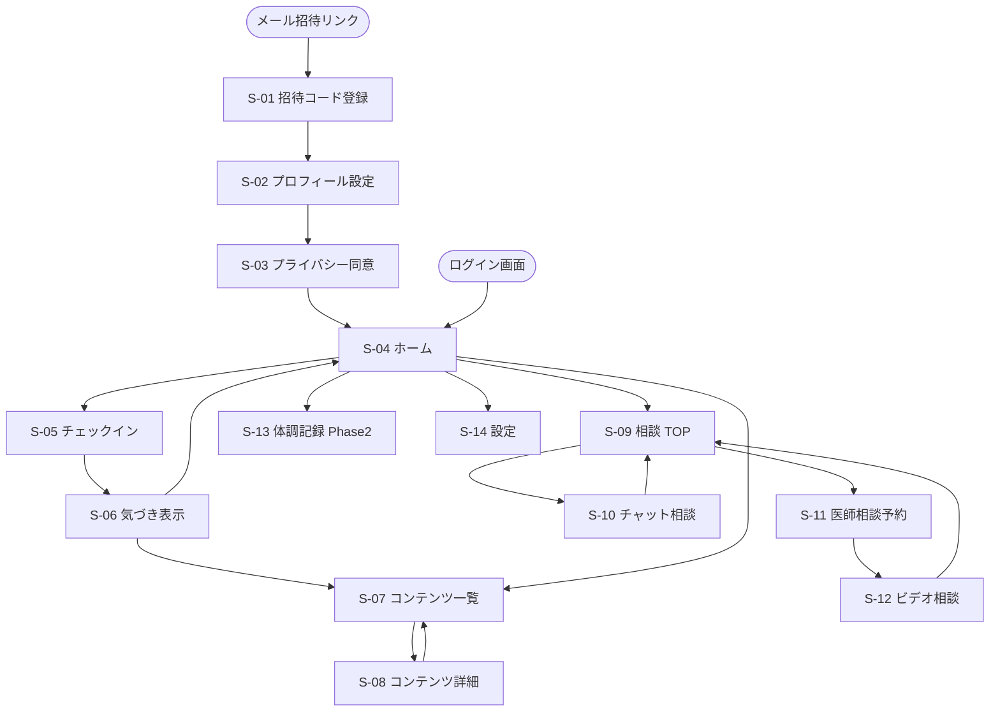
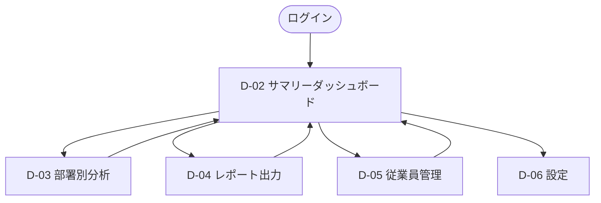
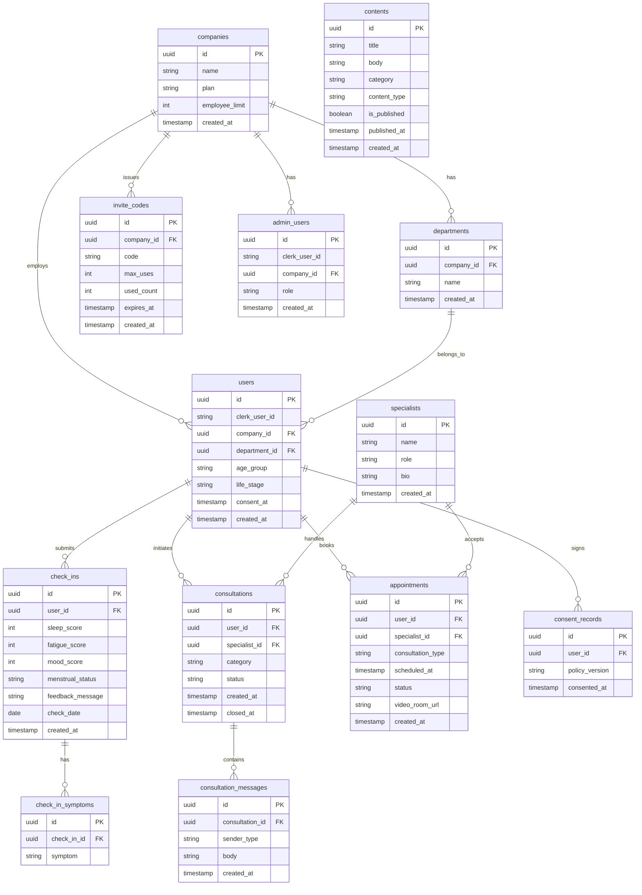
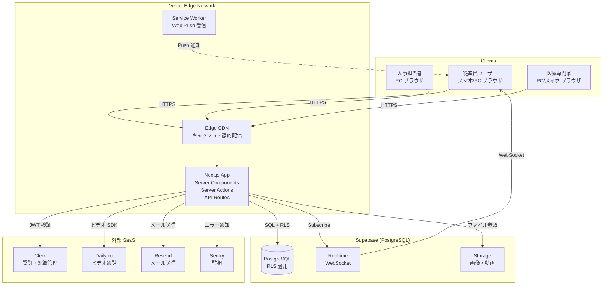
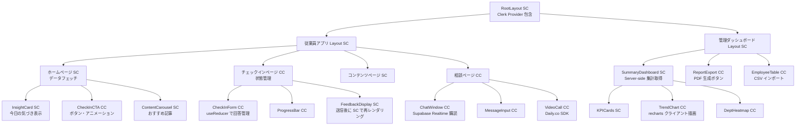

# 要件定義書 — Femcare（仮）企業向け女性健康管理プラットフォーム

**バージョン:** 1.0.0  
**作成日:** 2026-06-02  
**ステータス:** Draft

---

## 1. プロジェクト概要

### 1.1 プロジェクト名

**「Femcare — 企業向け女性健康管理プラットフォーム 開発プロジェクト」**

### 1.2 背景・目的

- **背景:** 大手企業に勤める女性従業員が、月経・PMS・更年期・妊活などの女性特有の体調変化を「大したことない」と放置し、不調の蓄積が離職・休職につながっている。婦人科受診は「仕事中に行けない」「予約が取れない」ハードルが高く、職場の産業医には「情報漏洩」を恐れて相談できない状況がある。女性活躍推進法の義務化拡大・健康経営優良法人認定制度の注目度上昇を受け、企業側にも対策の必要性が高まっている。
- **目的:**
  - 従業員の月次アクティブ率 60% 以上（月 4 回以上チェックイン）を達成
  - 専門家相談利用率を MAU の 20% 以上に引き上げ
  - 導入企業の継続契約率 90% 以上・NPS（従業員）40 以上を実現
  - 1 年後に導入企業 10 社・ARR 1 億円を達成

### 1.3 システムのビジョン / スコープ

- **ビジョン:** 「忙しくても続けられる毎日 1 分のチェックが、女性の体の変化への気づきを生み、必要な時に専門家につながれる」プラットフォームとして、日本の大手企業における女性の健康課題解決と女性活躍推進を支援する。
- **スコープ（本フェーズ MVP に含む）:**
  - 従業員向け Web アプリ（体調チェックイン・コンテンツ閲覧・専門家相談）
  - 企業・人事向け管理ダッシュボード（匿名集計・PDF レポート出力）
- **スコープ外（本フェーズ対象外）:**
  - iOS / Android ネイティブアプリ
  - Apple Health / Google Fit 連携
  - 産業医連携機能
  - 多言語対応
  - コミュニティ機能

---

## 2. ビジネス要件

### 2.1 ビジネスモデル情報

#### リーンキャンバス要約

| 項目 | 内容 |
|------|------|
| **解決する課題** | ①女性従業員の体調変化が職場で見過ごされ不調が蓄積する ②婦人科受診ハードルが高く「相談できる場所がない」 ③企業が女性健康課題を可視化できていない |
| **価値提案** | 毎日 1 分のチェックインで体調パターンを把握し、気軽に専門家相談できる一気通貫の体験。企業には匿名集計データ＋健康経営レポート自動生成で導入理由を明確化 |
| **顧客セグメント** | BtoB: 大手企業（人事部・健康経営推進担当）。エンドユーザー: 20〜50 代の大手企業勤務女性従業員 |
| **収益構造** | B2B 月額サブスクリプション（¥500〜¥2,000 / 人・月）。最低 100 名・12 ヶ月契約 |
| **チャネル** | 直販営業（健康経営イベント出展）、代理店開拓、健保連携 |
| **コスト構造** | 医療専門家ネットワーク維持費（相談報酬）、コンテンツ制作・監修費、システム開発・運用費 |
| **競争優位性** | 「気づき→学び→専門家相談」の 3 ステップ一気通貫 ＋ 健康経営レポート自動生成。医療専門家ネットワーク（Moat）と企業導入実績による信頼性 |

#### 7 Powers 視点での優位性

| Power | 評価 |
|-------|------|
| **スケール経済** | ユーザー数増加に比例しない固定コスト（コンテンツ・プラットフォーム）でマージン改善 |
| **ネットワーク効果** | 体調データの蓄積によるパーソナライズ精度向上（データ Network Effect） |
| **参入障壁** | 医療専門家ネットワーク（産婦人科医・助産師）の構築は模倣困難。企業導入実績が信頼性 Moat を形成 |
| **ブランド** | 女性健康 × 企業向けの先行ポジション確立で認知度優位 |

### 2.2 成果指標（KPI / KGI）

#### 従業員エンゲージメント指標

| KPI | 目標値 | 計測タイミング |
|-----|--------|----------------|
| 月次アクティブ率（MAU） | 登録者の 60% 以上（月 4 回以上チェックイン） | 毎月末 |
| 週次チェックイン頻度 | 平均週 3 回以上 | 毎週月曜日 |
| コンテンツ閲覧率 | MAU の 50% 以上 | 毎月末 |
| 専門家相談利用率 | MAU の 20% 以上 / 月 | 毎月末 |
| NPS（従業員） | 40 以上 | 四半期アンケート |

#### ビジネス指標

| KPI | 目標値 | 計測タイミング |
|-----|--------|----------------|
| 導入企業数 | 1 年後 10 社以上 | 四半期ごと |
| 年間継続率（リテンション） | 90% 以上 | 年次更新時 |
| NPS（人事担当） | 45 以上 | 四半期アンケート |
| ARR | 1 年後 1 億円 | 毎月 |

#### マイルストーン

| 時期 | 目標 |
|------|------|
| 0〜3 ヶ月目 | MVP 開発完了・専門家ネットワーク構築 |
| 3〜6 ヶ月目 | パイロット 3 社・登録ユーザー 300 名 |
| 6〜9 ヶ月目 | 正式リリース・5 社達成 |
| 9〜12 ヶ月目 | 10 社・MAU 60% 達成・ARR 1 億円 |

### 2.3 ビジネス上の制約

| 制約 | 詳細 |
|------|------|
| 開発期間 | MVP は 3 ヶ月以内にリリース |
| 開発体制（仮定） | フルスタック開発者 2〜3 名。インフラ費用は月額 10〜30 万円以内 |
| 医師法・薬機法 | 「診断」「処方」に相当する機能・表現は実装しない。医療行為とならない「相談」の範囲に限定 |
| 個人情報保護法 | 個人の体調データは企業側から絶対に特定できない設計。集計は 5 名以上のグループ単位 |
| 専門家確保 | 産婦人科医 3 名・助産師 5 名以上との契約完了が MVP 前提条件 |

---

## 3. ユーザー要件

### 3.1 ユーザープロファイル / ペルソナ

#### ペルソナ A：従業員ユーザー（30 代・月経ケア層）

| 項目 | 内容 |
|------|------|
| 名前（仮） | 田中 さやか |
| 年齢 | 32 歳 |
| 職業 | 大手メーカー 営業職、フルタイム・残業あり |
| 利用デバイス | iPhone（スマホメイン）。通勤中・昼休みに使用 |
| ペイン | 月経前のイライラ・集中力低下を「気のせい」と我慢。受診すべきか判断できず先延ばし。産業医には相談しにくい |
| ゴール | 自分の体調パターンを客観的に把握し、「受診すべきか」を気軽に専門家に聞ける場所が欲しい |
| 利用シーン | 朝のチェックイン（通勤中）、体調が気になった時の専門家相談 |

#### ペルソナ B：企業側ユーザー（人事担当）

| 項目 | 内容 |
|------|------|
| 名前（仮） | 山本 健一 |
| 年齢 | 43 歳 |
| 職業 | 大手企業 人事部 健康経営推進担当 |
| 利用デバイス | PC メイン（月次・四半期でのデスクワーク中） |
| ペイン | 女性従業員の健康課題を可視化できていない。健康経営レポート作成が手間。導入ツールが使われずに終わる失敗経験あり |
| ゴール | 経営層・健保に提出できるレポートが自動で作れること。従業員に継続使用されるツール |
| 利用シーン | 月次・四半期でダッシュボードにログインしてレポート出力 |

### 3.2 ユーザーストーリー

| No | ストーリー |
|----|-----------|
| US-01 | **田中さやか（従業員）として、** 毎朝 1 分でタップするだけで体調を記録したい。**なぜなら**、忙しい中でも続けられないと意味がないからだ。 |
| US-02 | **田中さやか（従業員）として、** 体調チェック後にパーソナライズされた気づきメッセージを受け取りたい。**なぜなら**、「月経前だからイライラしているのか」と自分の体のパターンに気づくことで、不調を受け入れやすくなるからだ。 |
| US-03 | **田中さやか（従業員）として、** 「受診すべきか」を看護師に気軽にテキストで相談したい。**なぜなら**、受診するほどでもないかもしれないが、この症状が不安だからだ。 |
| US-04 | **山本健一（人事担当）として、** 部署別・年代別の体調傾向をダッシュボードで確認し、月次レポートを PDF でダウンロードしたい。**なぜなら**、経営会議に提出できるデータとして女性活躍推進の施策効果を示す必要があるからだ。 |
| US-05 | **山本健一（人事担当）として、** 健康経営優良法人認定に必要なデータを一括出力したい。**なぜなら**、申請書類の作成が毎年手間で、エビデンスデータの収集に工数がかかっているからだ。 |

### 3.3 MVP（Minimum Viable Product）の定義

**MVP の目的:** パイロット企業 1〜3 社での実証を通じて、以下の仮説を検証する
1. 従業員が毎日チェックインを継続するか（習慣化できるか）
2. 専門家相談が実際に使われるか
3. 人事担当者がダッシュボードを活用し、継続契約の意向を持つか

**MVP で実装する機能:**

| カテゴリ | 機能 |
|----------|------|
| 従業員アプリ | 招待コード登録・アカウント作成、プロフィール設定、プライバシー同意フロー |
| | 毎日の体調チェック（5〜7 問）、「今日の気づき」フィードバック |
| | チェックインリマインダー（Web Push / メール） |
| | コンテンツ閲覧（記事形式） |
| | チャット相談（看護師・助産師） |
| | オンライン相談予約・実施（産婦人科医・テキスト＋ビデオ） |
| 管理ダッシュボード | 管理者アカウント・部署設定、従業員一括招待 |
| | 全体・部署別体調傾向ダッシュボード |
| | 月次レポート PDF 出力、健康経営優良法人認定用データ出力 |

**MVP のゴール:** パイロット開始 1 ヶ月後に月次アクティブ率 50% 以上、パイロット終了後に企業継続意向 80% 以上

---

## 4. 機能要件

### 4.1 機能一覧 / MoSCoW 分類

| 機能 ID | 機能名 | 要約 | MoSCoW | MVP 対象 |
|---------|--------|------|--------|---------|
| F-001 | 招待コード登録 | 企業発行コードでアカウント作成（メール＋パスワード） | Must | Yes |
| F-002 | プロフィール設定 | 年代・ライフステージ選択（パーソナライズ基礎） | Must | Yes |
| F-003 | プライバシー同意フロー | 「個人データは会社に共有されません」同意取得 | Must | Yes |
| F-004 | 毎日の体調チェック | 5〜7 問タップ式回答（1 分以内） | Must | Yes |
| F-005 | 「今日の気づき」フィードバック | チェック結果に基づくパーソナライズメッセージ | Must | Yes |
| F-006 | チェックインリマインダー | Web Push / メール通知（ユーザー設定時刻） | Must | Yes |
| F-007 | ライフステージ別コンテンツ閲覧 | 5 カテゴリの専門家監修記事 | Must | Yes |
| F-008 | コンテンツレコメンド | 体調チェック結果に応じた記事提案 | Must | Yes |
| F-009 | チャット相談（看護師・助産師） | テキスト相談・24 時間以内初回返信 | Must | Yes |
| F-010 | オンライン相談予約（産婦人科医） | 空き枠カレンダーから予約（テキスト/ビデオ選択） | Must | Yes |
| F-011 | ビデオ相談 | 産婦人科医とのビデオ通話 | Must | Yes |
| F-012 | 相談返信通知 | Web Push / メールで返信通知 | Must | Yes |
| F-013 | 管理者アカウント管理 | 人事担当者のアカウント発行・権限設定 | Must | Yes |
| F-014 | 部署・組織設定 | 部署情報の登録・編集 | Must | Yes |
| F-015 | 従業員一括招待 | CSV アップロードで招待メール一括送信 | Must | Yes |
| F-016 | 利用状況確認 | 登録者数・アクティブ率確認 | Must | Yes |
| F-017 | 全体ダッシュボード | 匿名集計による月次サマリー（体調傾向・利用率） | Must | Yes |
| F-018 | 部署別・年代別分析 | 部署・年代ごとの体調傾向比較 | Must | Yes |
| F-019 | 月次レポート PDF 出力 | 経営会議・健保向けレポート自動生成 | Must | Yes |
| F-020 | 健康経営認定用データ出力 | 経産省フォーマット対応データ一括出力 | Must | Yes |
| F-021 | 体調カレンダー・グラフ | 月間カレンダー＋推移グラフ | Should | No |
| F-022 | 月経周期トラッキング | 周期予測・記録 | Should | No |
| F-023 | 短動画コンテンツ | 2〜5 分の専門家解説動画 | Should | No |
| F-024 | 休職・離職リスクアラート | スコア低傾向グループへの匿名アラート | Should | No |
| F-025 | 体調データ事前共有 | 相談時に体調履歴を医師に自動連携 | Should | No |
| F-026 | 相談履歴・メモ保存 | 相談内容・医師アドバイスの記録 | Should | No |
| F-027 | コンテンツ既読管理 | 閲覧済み記事の管理 | Should | No |
| F-028 | 症状トレンド | よく報告される症状の集計 | Should | No |
| F-029 | 産業医連携機能 | 産業医へのアクセス・連携 | Could | No |
| F-030 | コンテンツ検索 | キーワード検索 | Could | No |
| F-031 | カスタムレポート | 期間・項目を指定してダウンロード | Could | No |
| F-032 | Apple Health / Google Fit 連携 | 歩数・睡眠データの取り込み | Won't | No |
| F-033 | コミュニティ機能 | 同僚との匿名コミュニティ | Won't | No |
| F-034 | 多言語対応 | 英語等への対応 | Won't | No |

### 4.2 機能詳細仕様

#### 4.2.1 `F-001: 招待コード登録・認証`

- **概要:** 企業が発行した招待コードを使い、従業員がアカウントを作成する。B2B クローズドモデルのため招待コードなしでは登録不可
- **ユースケース:** 「パイロット企業 A 社の人事担当者が招待メールを一括送信し、従業員が受信したリンクからアカウントを作成するとき」
- **前提条件:** 企業管理者が招待コードを発行済み。招待リンクをメールで受信済み
- **正常系フロー:**
  1. 従業員が招待メール内のリンクをタップ（ブラウザが開く）
  2. 招待コードが URL パラメータから自動入力される（手入力も可）
  3. メールアドレス・パスワード（8 文字以上・英数字混在）を入力
  4. Clerk により認証情報を作成。招待コードの有効性・使用回数を検証
  5. プロフィール設定画面へ遷移（年代・ライフステージ選択）
  6. プライバシーポリシー同意画面 → 同意後ホーム画面へ
- **例外系フロー:**
  - 招待コードが無効・期限切れ → 「このリンクは無効または期限切れです。人事担当者にご確認ください」と表示
  - 招待コードの使用上限到達 → 同上
  - パスワードが要件未満 → 「8 文字以上の英数字を含むパスワードを設定してください」をリアルタイム表示
  - すでに登録済みのメールアドレス → 「このメールアドレスはすでに登録されています。ログインしてください」
- **UI 要件:**
  - 招待コードのフィールドは URL パラメータから自動入力（編集不可グレーアウト）
  - パスワード強度インジケーターをリアルタイム表示
  - 「会社にデータは共有されません」の安心バッジをフォーム下部に常時表示
- **非機能面注意:**
  - 招待コードはランダム 12 桁の英数字。有効期限 30 日・使用回数上限は企業設定値（デフォルト: 無制限）
  - パスワードは Clerk が管理（平文保存なし）
  - CSRF / XSS 対策は Clerk と Next.js の標準機能に依拠

---

#### 4.2.2 `F-004 / F-005: 毎日の体調チェックイン＆「今日の気づき」`

- **概要:** 毎朝 1 分以内で完了するタップ式体調チェック。送信後にパーソナライズされた「今日の気づき」メッセージと関連コンテンツを表示する
- **ユースケース:** 「田中さやかが通勤中にスマホで朝の体調チェックを完了し、PMSに関する気づきメッセージを受け取るとき」
- **前提条件:** ログイン済み。本日分のチェックインが未完了
- **正常系フロー:**
  1. Web Push 通知またはメール通知を受信 → ブラウザでチェックイン画面が開く
  2. 進捗バー（1/5 〜 5/5）を表示しながら以下の質問に順次タップ回答
     - Q1: 睡眠の質（⭐ 1〜5 の 5 段階タップ）
     - Q2: 身体の疲れ（⭐ 1〜5 の 5 段階タップ）
     - Q3: 気分・メンタル（⭐ 1〜5 の 5 段階タップ）
     - Q4: 気になる症状（頭痛 / 腹痛 / むくみ / ほてり / 倦怠感 / その他 から複数選択、なしも選択可）
     - Q5: 月経状況（今日は月経中 / 月経前 / 通常期）
  3. 「送信」ボタンタップ → Supabase に保存
  4. 「今日の気づき」画面を表示
     - パーソナライズメッセージ（例:「月経前の時期です。イライラや集中力低下は PMS のサインかもしれません」）
     - 関連コンテンツのカード 1〜3 件
  5. ホームに戻る or コンテンツを閲覧
- **フィードバックロジック（仮定）:**
  - 月経状況＋症状の組み合わせから最も関連性の高いメッセージテンプレートを選択
  - テンプレートは 20〜30 種類を専門家監修のもと事前準備
  - 将来的に ML による精度向上を検討（Phase 3 以降）
- **例外系フロー:**
  - 通信エラー時 → 「ネットワークに接続されていません。もう一度お試しください」を表示（回答は端末に一時保存）
  - 本日分を既に送信済みの場合 → 送信済みメッセージを再表示（再送信不可）
- **UI 要件:**
  - 全問タップのみで完結（テキスト入力なし）。1 画面 1 質問のカード式 UI
  - 進捗バーを常時表示（「あと ○ 問」）
  - 症状選択はチップ式（複数タップ可）
  - 送信完了時にソフトアニメーション（チェックマーク表示 0.5 秒）
- **受け入れ条件:**
  - 回答から送信完了まで 1 分以内
  - フィードバックメッセージは入力内容に応じてパーソナライズ（同一メッセージが 5 日連続表示にならない）
  - 送信後に関連コンテンツが 1〜3 件表示される

---

#### 4.2.3 `F-009: チャット相談（看護師・助産師）`

- **概要:** 従業員が気になる症状を看護師・助産師にテキストで相談できる。24 時間以内の初回返信を保証。「診断」「処方」に相当する表現は禁止
- **ユースケース:** 「田中さやかが月経前に頭痛が続き、受診すべきか気になったとき、看護師に気軽にチャットで相談するとき」
- **前提条件:** ログイン済み。プレミアムまたはスタンダードプランの契約企業に所属
- **正常系フロー:**
  1. ホーム or 「今日の気づき」から「相談する」をタップ
  2. 相談カテゴリを選択（月経 / PMS / 更年期 / 妊活 / メンタル / その他）
  3. 症状・体調の概要をテキスト入力（任意で体調チェック履歴を添付）
  4. 送信 → Supabase にメッセージ保存。専門家側の管理画面に通知
  5. 看護師・助産師がアサインされる（システム自動割り当て or 手動、数時間〜翌日）
  6. Supabase Realtime でチャットをリアルタイム表示
  7. 返信が来たら Web Push / メール通知
  8. 「受診が必要」と判断された場合 → 看護師が産婦人科医オンライン相談への案内メッセージを送信
- **例外系フロー:**
  - 24 時間以内に初回返信がない場合 → システムが看護師に再通知。ユーザーには「担当者が確認しています。もうしばらくお待ちください」と自動メッセージ
  - 緊急性が高い症状と判断された場合（胸痛・意識障害等）→ 「こちらの症状は今すぐ救急または医療機関を受診してください」と定型メッセージを即時返信
- **UI 要件:**
  - メッセージ UI はシンプルな吹き出し形式（ユーザー右側・専門家左側）
  - 医療相談画面は「このサービスは医療行為ではありません」をヘッダーに固定表示
  - 相談内容は「企業に共有されません」の安心バッジをチャット画面に常時表示
  - 担当者名は「看護師 A」等の匿名表示（フルネーム非公開、仮定）
- **受け入れ条件:**
  - 送信後 24 時間以内に初回返信がある
  - 「診断」「処方」に相当する表現は使用しない（ガイドライン違反チェック体制を整備）
  - 相談履歴はユーザー自身のみ閲覧可能（企業側には非公開）

---

## 5. UI/UX 設計

### 5.1 デザインコンセプト

- **テーマ:** 「やさしい、プロフェッショナル」
- **ブランドボイス:** 寄り添い・安心感・シンプル。医療用語より平易な言葉（「黄体期」より「月経前の時期」）。過度な医療感（注射・赤十字等のアイコン）は使用しない
- **避けるべき UX:** 「健康診断」感・過剰な通知・催促。管理される感覚にならないよう数値・スコアの前面表示を避ける

### 5.2 カラーパレット

| 役割 | 名前 | HEX | 用途 |
|------|------|-----|------|
| Primary | ダスティローズ | `#C97A72` | メインボタン・アクティブ状態・ブランドカラー |
| Primary Light | ライトローズ | `#F2E0DE` | 背景ハイライト・カード背景 |
| Accent | セージグリーン | `#4A7C6F` | サブアクション・完了状態 |
| Accent Light | ライトセージ | `#DCF0EB` | タグ・バッジ背景 |
| Background | ウォームホワイト | `#FAF8F5` | アプリ全体背景 |
| Surface | ホワイト | `#FFFFFF` | カード・モーダル背景 |
| Text Primary | チャコール | `#2D2D2D` | 見出し・本文 |
| Text Secondary | ミディアムグレー | `#6B6B6B` | サブテキスト・キャプション |
| Border | ライトグレー | `#E5E2DF` | 区切り線 |
| Medical | クールブルー | `#EEF3F7` | 相談・医療セクション背景 |
| Error | ウォームレッド | `#D95B4A` | エラー表示 |
| Warning | アンバー | `#E8A87C` | 注意・アラート |
| Success | ソフトグリーン | `#6BAB8F` | 完了・ポジティブフィードバック |

### 5.3 タイポグラフィ

| 役割 | フォント | ウェイト | サイズ |
|------|----------|----------|--------|
| H1 見出し | Noto Sans JP | Bold 700 | 24px |
| H2 見出し | Noto Sans JP | SemiBold 600 | 20px |
| H3 見出し | Noto Sans JP | SemiBold 600 | 17px |
| 本文 | Noto Sans JP | Regular 400 | 15px / 行間 1.75 |
| キャプション | Noto Sans JP | Regular 400 | 12px |
| ボタン | Noto Sans JP | Medium 500 | 15px |
| 英数字 | Inter | （同ウェイト） | 対応サイズ |

### 5.4 画面一覧

#### 従業員アプリ

| 画面 ID | 画面名 | 目的 | 主要要素 |
|---------|--------|------|----------|
| S-01 | 招待コード登録 | アカウント作成 | 招待コード入力・メール・パスワードフォーム |
| S-02 | プロフィール設定 | 年代・ライフステージ設定 | 選択ボタン群 |
| S-03 | プライバシー同意 | データ非公開の同意取得 | ポリシー本文・同意ボタン |
| S-04 | ホーム | 今日の状態とアクション把握 | 今日の気づき・チェックイン CTA・コンテンツカード |
| S-05 | チェックイン | 毎日の体調入力 | タップ式回答・進捗バー |
| S-06 | 気づき表示 | フィードバック確認 | パーソナライズメッセージ・関連コンテンツ |
| S-07 | コンテンツ一覧 | 学びたいテーマを選ぶ | カテゴリタブ・カード一覧 |
| S-08 | コンテンツ詳細 | 記事を読む | 本文・関連コンテンツ |
| S-09 | 相談 TOP | 相談方法の選択 | チャット相談 / 医師相談の導線 |
| S-10 | チャット相談 | 看護師・助産師とやり取り | メッセージ UI・カテゴリ選択 |
| S-11 | 医師相談予約 | 産婦人科医の空き枠選択 | カレンダー・相談形式選択 |
| S-12 | ビデオ相談 | 産婦人科医とのビデオ通話 | ビデオ UI |
| S-13 | 体調記録（Phase 2） | 過去の体調振り返り | カレンダー・グラフ |
| S-14 | 設定 | 通知・プロフィール管理 | 各種設定項目 |

#### 管理ダッシュボード

| 画面 ID | 画面名 | 目的 | 主要要素 |
|---------|--------|------|----------|
| D-01 | ログイン | 管理者認証 | メール・パスワードフォーム |
| D-02 | サマリーダッシュボード | 全体状況の把握 | KPI カード・グラフ |
| D-03 | 部署別分析 | 部署ごとの傾向比較 | 棒グラフ・ヒートマップ |
| D-04 | レポート出力 | 各種レポートの DL | 期間選択・フォーマット選択・PDF 出力 |
| D-05 | 従業員管理 | 招待・利用状況管理 | テーブル・CSV インポート |
| D-06 | 設定 | 組織情報・管理者設定 | フォーム |

### 5.5 画面遷移図

#### 従業員アプリ



#### 管理ダッシュボード



### 5.6 ワイヤーフレーム（テキストベース）

#### S-04: ホーム画面

```
┌─────────────────────────────┐
│ [Femcare ロゴ]    [通知 🔔] │  ← ヘッダー (高さ 56px)
├─────────────────────────────┤
│ こんにちは、さやかさん       │  ← グリーティング (Text Secondary)
│                             │
│ ┌─────────────────────────┐ │
│ │ 今日の気づき 💡          │ │  ← 気づきカード (Primary Light 背景)
│ │ 月経前の時期です。        │ │
│ │ イライラは PMS かも。     │ │
│ │ [詳しく読む →]           │ │
│ └─────────────────────────┘ │
│                             │
│ ┌─────────────────────────┐ │
│ │  今日の体調チェックを     │ │  ← チェックイン CTA (Primary)
│ │     [する → 1分]         │ │
│ └─────────────────────────┘ │
│                             │
│ おすすめコンテンツ           │  ← セクションヘッダー
│ ┌──────┐ ┌──────┐ ┌──────┐ │
│ │記事A │ │記事B │ │記事C │ │  ← コンテンツカード (横スクロール)
│ └──────┘ └──────┘ └──────┘ │
├─────────────────────────────┤
│ [ホーム] [コンテンツ] [相談] [記録] [設定] │  ← ボトムナビ
└─────────────────────────────┘
```

#### S-05: チェックイン画面（1 問目）

```
┌─────────────────────────────┐
│ ←戻る   体調チェック  1/5   │  ← ヘッダー
│ ████████░░░░░░░░░░░░ 20%   │  ← 進捗バー (Primary)
├─────────────────────────────┤
│                             │
│   昨晩の睡眠の質は          │  ← 質問テキスト (H2, 中央揃え)
│   どうでしたか？            │
│                             │
│   ★ ★ ★ ☆ ☆              │  ← 5 段階タップ (大きめ 48x48px)
│  とても悪い     とても良い  │  ← ラベル (Text Secondary, 小)
│                             │
│        [次へ →]             │  ← Primary ボタン
└─────────────────────────────┘
```

#### D-02: サマリーダッシュボード

```
┌──────────────────────────────────────────┐
│ Femcare 管理ダッシュボード [山本 健一 ▼] │  ← ヘッダー
├────────┬─────────────────────────────────┤
│ナビ    │ 2026年 5月 サマリー    [PDF出力] │
│        ├──────────┬──────────┬───────────┤
│ダッシュ│ アクティブ│ 相談利用率│ 平均体調  │  ← KPI カード
│ボード  │ 率: 65%  │ 22%      │ スコア3.8 │
│        ├──────────┴──────────┴───────────┤
│部署別  │ [体調スコア推移グラフ - 折れ線]   │
│分析    │                                  │
│        ├──────────────────────────────────┤
│レポート│ 部署別 体調傾向ヒートマップ       │
│出力    │ [開発] [営業] [人事] [マーケ]    │
│        │ ※ 5名未満のグループは非表示      │
│従業員  ├──────────────────────────────────┤
│管理    │ よく報告される症状 TOP 5          │
│        │ 1. 疲れやすい 2. 頭痛 3. むくみ  │
│設定    │                                  │
└────────┴──────────────────────────────────┘
```

---

## 6. 非機能要件

### 6.1 パフォーマンス要件

| 要件 | 目標値 | 計測方法 |
|------|--------|----------|
| チェックイン画面の初期表示 | 1 秒以内（LCP） | Vercel Analytics / Lighthouse |
| 相談メッセージの送信 | 即時（非同期処理）。送信完了 Toast を 1 秒以内に表示 | Sentry トランザクション |
| ダッシュボードデータ反映 | リアルタイム〜24 時間以内 | Supabase Realtime / バッチ処理ログ |
| 同時接続数 | MVP: 100 同時接続、1 年後: 5,000 同時接続 | Vercel Analytics |
| API レスポンスタイム | 主要 API（チェックイン送信・相談送信）は 500ms 以内 | Sentry |

### 6.2 セキュリティ要件

| 要件 | 詳細 |
|------|------|
| 通信暗号化 | すべての通信を TLS 1.3 以上で暗号化 |
| 認証・認可 | Clerk による JWT ベースの認証。招待コード制による閉域アクセス。企業管理者・従業員・医療専門家の権限分離 |
| 個人特定防止 | Supabase Row Level Security により、従業員が自分のデータのみ読み書き可能。管理者は集計データのみ参照可能（個人行データへのアクセス不可） |
| データ暗号化 | DB 内の医療関連情報（症状・相談内容）は Supabase の保存時暗号化（AES-256）を適用 |
| 監査ログ | 管理者操作ログ（ログイン・データ参照・レポート出力）を Supabase に記録 |
| コンプライアンス | 個人情報保護法準拠。プライバシーポリシーの版管理・同意記録を DB に保存 |
| CSRF / XSS 対策 | Next.js の標準セキュリティヘッダー適用。Clerk の CSRF 保護機能を活用 |

### 6.3 可用性・信頼性

| 要件 | 詳細 |
|------|------|
| 稼働率 | 99.5% 以上（月次ダウンタイム約 3.6 時間以内） |
| バックアップ | Supabase による自動 DB バックアップ（日次、保存期間 7 日） |
| 障害時の復旧 | Vercel のロールバック機能による即時切り戻し。平均復旧時間（MTTR）1 時間以内を目標（仮定） |
| メンテナンス | 深夜 2〜4 時（朝のチェックイン利用前）にメンテナンスウィンドウを設定 |

### 6.4 ユーザビリティ / UI・UX

| 要件 | 詳細 |
|------|------|
| アクセシビリティ | WCAG 2.1 AA 準拠を目標。カラーコントラスト比 4.5:1 以上。タップターゲット 44px 以上 |
| モバイル対応 | モバイルファースト。iOS Safari 16+、Android Chrome 最新 2 バージョンをサポート |
| 操作導線 | 毎日使う「チェックイン → 気づき → コンテンツ」の導線は最大 3 タップで到達 |
| ダークモード | MVP 対象外。Phase 2 で検討 |
| 多言語対応 | MVP は日本語のみ |

### 6.5 スケーラビリティ

| フェーズ | 規模 | インフラ方針 |
|----------|------|-------------|
| MVP | 1〜3 社・数百名 | Vercel Hobby/Pro + Supabase Pro プラン |
| 1 年後 | 10 社・数万名 | Supabase Business プラン（接続プーリング・Read Replica 設定） |
| 将来 | 50 社以上 | Supabase Enterprise or セルフホスト PostgreSQL への移行検討 |

---

## 7. データベース設計

### 7.1 ER 図



### 7.2 テーブル定義

#### `users` テーブル

| カラム名 | データ型 | 制約 | 説明 |
|----------|----------|------|------|
| `id` | `uuid` | PK, DEFAULT `gen_random_uuid()` | ユーザー識別子 |
| `clerk_user_id` | `text` | NOT NULL, UNIQUE | Clerk が発行する外部 ID |
| `company_id` | `uuid` | NOT NULL, FK → `companies.id` | 所属企業 |
| `department_id` | `uuid` | FK → `departments.id` | 所属部署（任意） |
| `age_group` | `text` | NOT NULL | `20s` / `30s` / `40s` / `50s` |
| `life_stage` | `text` | NOT NULL | `menstrual` / `妊活` / `postpartum` / `menopause` |
| `consent_at` | `timestamptz` | NOT NULL | プライバシーポリシー同意日時 |
| `created_at` | `timestamptz` | NOT NULL, DEFAULT `now()` | 登録日時 |

**RLS ポリシー:**
- `SELECT`: `auth.uid()` が `clerk_user_id` と一致するレコードのみ
- `INSERT`: 招待コード検証済みのリクエストのみ（Server Action で制御）
- 管理者ユーザーからは直接参照不可（集計 View 経由のみ）

---

#### `check_ins` テーブル

| カラム名 | データ型 | 制約 | 説明 |
|----------|----------|------|------|
| `id` | `uuid` | PK | チェックイン識別子 |
| `user_id` | `uuid` | NOT NULL, FK → `users.id` | 記録者 |
| `sleep_score` | `smallint` | NOT NULL, CHECK (1-5) | 睡眠の質 |
| `fatigue_score` | `smallint` | NOT NULL, CHECK (1-5) | 身体の疲れ |
| `mood_score` | `smallint` | NOT NULL, CHECK (1-5) | 気分・メンタル |
| `menstrual_status` | `text` | NOT NULL | `menstrual` / `premenstrual` / `normal` |
| `feedback_message` | `text` | | 表示した気づきメッセージ |
| `check_date` | `date` | NOT NULL | チェックイン日（1 ユーザー / 1 日 1 レコード） |
| `created_at` | `timestamptz` | NOT NULL, DEFAULT `now()` | 作成日時 |

**インデックス:**
- `(user_id, check_date)` UNIQUE（1 日 1 チェックイン制約）
- `(user_id, created_at DESC)` - 履歴参照用

---

#### `consultations` テーブル

| カラム名 | データ型 | 制約 | 説明 |
|----------|----------|------|------|
| `id` | `uuid` | PK | 相談スレッド識別子 |
| `user_id` | `uuid` | NOT NULL, FK → `users.id` | 相談者 |
| `specialist_id` | `uuid` | FK → `specialists.id` | 担当専門家（アサイン前は NULL） |
| `category` | `text` | NOT NULL | `menstrual` / `pms` / `menopause` / `pregnancy` / `mental` / `other` |
| `status` | `text` | NOT NULL, DEFAULT `pending` | `pending` / `active` / `closed` |
| `created_at` | `timestamptz` | NOT NULL, DEFAULT `now()` | 相談開始日時 |
| `closed_at` | `timestamptz` | | 相談終了日時 |

**RLS ポリシー:**
- `SELECT / INSERT / UPDATE`: `user_id` が認証ユーザーに一致するレコードのみ
- 管理者からは参照不可（相談内容の機密性保護）

---

#### 匿名集計 View（管理ダッシュボード用）

管理者が直接 `check_ins` や `users` テーブルにアクセスできない設計とし、以下の集計 View 経由でのみ参照可能とする。5 名未満グループのデータは `NULL` として返す。

```sql
-- 例: 部署別月次体調スコア集計 View
CREATE VIEW department_monthly_summary AS
SELECT
    d.id AS department_id,
    d.name AS department_name,
    DATE_TRUNC('month', ci.check_date) AS month,
    CASE WHEN COUNT(DISTINCT ci.user_id) >= 5 THEN AVG(ci.mood_score) ELSE NULL END AS avg_mood_score,
    CASE WHEN COUNT(DISTINCT ci.user_id) >= 5 THEN AVG(ci.sleep_score) ELSE NULL END AS avg_sleep_score,
    CASE WHEN COUNT(DISTINCT ci.user_id) >= 5 THEN COUNT(DISTINCT ci.user_id) ELSE NULL END AS active_users
FROM check_ins ci
JOIN users u ON ci.user_id = u.id
JOIN departments d ON u.department_id = d.id
GROUP BY d.id, d.name, DATE_TRUNC('month', ci.check_date);
```

---

## 8. インテグレーション要件

### 8.1 外部サービス / SaaS 連携

| カテゴリ | サービス | 用途 |
|----------|----------|------|
| 認証 | **Clerk** | 招待コードベースのユーザー管理・JWT 発行・組織管理 |
| データベース | **Supabase (PostgreSQL)** | メインデータベース・RLS・Realtime チャット |
| ホスティング | **Vercel** | Next.js アプリのデプロイ・エッジキャッシュ |
| ビデオ通話 | **Daily.co** | 産婦人科医とのビデオ相談 SDK |
| PDF 生成 | **@react-pdf/renderer** | 月次レポート・健康経営認定用データの PDF 出力 |
| メール送信 | **Resend** | チェックインリマインダー・相談返信通知メール |
| Push 通知 | **Web Push API + Service Worker** | チェックインリマインダー・返信通知（ブラウザ Push） |
| エラー監視 | **Sentry** | エラートラッキング・パフォーマンス監視 |
| アナリティクス | **Vercel Analytics** | ページビュー・LCP・Web Vitals |

### 8.2 API 仕様

#### `POST /api/checkins` — 体調チェックイン送信

**認証:** Bearer トークン（Clerk JWT）必須

**リクエスト:**
```json
{
  "sleep_score": 3,
  "fatigue_score": 2,
  "mood_score": 2,
  "menstrual_status": "premenstrual",
  "symptoms": ["headache", "bloating"],
  "check_date": "2026-06-02"
}
```

**レスポンス 201 Created:**
```json
{
  "id": "xxxxxxxx-xxxx-xxxx-xxxx-xxxxxxxxxxxx",
  "feedback_message": "月経前の時期です。イライラや集中力の低下はPMSのサインかもしれません。無理せず休息を取りましょう。",
  "recommended_contents": [
    {
      "id": "content-001",
      "title": "PMSを乗り越える5つのセルフケア",
      "category": "pms",
      "thumbnail_url": "/images/contents/pms-care.jpg"
    }
  ]
}
```

**エラーレスポンス:**

| ステータス | コード | 説明 |
|-----------|--------|------|
| 400 | `INVALID_INPUT` | バリデーションエラー（スコア範囲外等） |
| 409 | `ALREADY_CHECKED_IN` | 本日分のチェックイン送信済み |
| 401 | `UNAUTHORIZED` | 認証トークン不正・期限切れ |

---

#### `POST /api/consultations` — 相談スレッド作成

**認証:** Bearer トークン必須

**リクエスト:**
```json
{
  "category": "pms",
  "initial_message": "月経前になると頭痛がひどくなります。受診すべきでしょうか？",
  "attach_check_in_history": true
}
```

**レスポンス 201 Created:**
```json
{
  "consultation_id": "xxxxxxxx-xxxx-xxxx-xxxx-xxxxxxxxxxxx",
  "status": "pending",
  "estimated_response_hours": 24
}
```

---

#### `GET /api/admin/dashboard/summary` — 管理ダッシュボードサマリー取得

**認証:** 管理者 JWT 必須。一般ユーザーからのアクセスは 403

**クエリパラメータ:**
- `month`: `2026-05`（YYYY-MM 形式）
- `department_id`: 任意（未指定の場合は全社）

**レスポンス 200 OK:**
```json
{
  "month": "2026-05",
  "active_rate": 0.65,
  "consultation_rate": 0.22,
  "avg_mood_score": 3.4,
  "departments": [
    {
      "department_id": "dept-001",
      "department_name": "営業部",
      "active_users": 28,
      "avg_mood_score": 3.2,
      "top_symptoms": ["fatigue", "headache"]
    }
  ],
  "anonymization_note": "5名未満のグループのデータは含まれていません"
}
```

---

#### `POST /api/admin/reports/generate` — PDF レポート生成

**認証:** 管理者 JWT 必須

**リクエスト:**
```json
{
  "report_type": "monthly",
  "period": { "from": "2026-05-01", "to": "2026-05-31" },
  "department_ids": ["dept-001", "dept-002"],
  "format": "kenkokeiei_v2026"
}
```

**レスポンス 200 OK:**
```json
{
  "download_url": "https://...",
  "expires_at": "2026-06-02T20:00:00Z"
}
```

### 8.3 データ連携要件

| 連携 | 形式 | 頻度 | 再送制御 |
|------|------|------|---------|
| 従業員一括招待（CSV インポート） | CSV（UTF-8） | 都度 | バリデーションエラー行をレポート表示。成功行のみ処理 |
| チャット Realtime | JSON（WebSocket） | リアルタイム | Supabase Realtime の自動再接続に依拠 |
| チェックインリマインダー（メール） | JSON → Resend API | バッチ（日次・ユーザー設定時刻） | 失敗時 3 回リトライ（指数バックオフ） |
| PDF ダウンロード | PDF バイナリ | 都度 | 生成後 24 時間の署名付き URL を発行 |

---

## 9. 技術選定とアーキテクチャ

### 9.1 技術スタックの要約

| レイヤー | 技術 |
|----------|------|
| フロントエンド | Next.js 14+ (App Router), React 18, TypeScript |
| スタイリング | Tailwind CSS + shadcn/ui（コンポーネントライブラリ） |
| バックエンド | Next.js Server Actions / Route Handlers (API Routes) |
| データベース | Supabase (PostgreSQL 15+), Row Level Security |
| 認証 | Clerk（招待コード・組織管理・JWT） |
| ホスティング | Vercel（Edge Network） |
| ビデオ通話 | Daily.co SDK |
| PDF 生成 | @react-pdf/renderer |
| メール | Resend |
| Push 通知 | Web Push API + Service Worker |
| 監視 | Sentry, Vercel Analytics |
| CI/CD | GitHub Actions + Vercel 自動デプロイ |

### 9.2 アーキテクチャ概要図



### 9.3 コンポーネント階層図

Server Components（SC）はデータフェッチ・静的レンダリング担当、Client Components（CC）はインタラクション・状態管理担当とする。



### 9.4 主要コンポーネント設計方針

#### `CheckInForm`（Client Component）

```typescript
// Props
interface CheckInFormProps {
  userId: string;
  todayDate: string; // サーバーから渡す（タイムゾーン対応）
  onComplete: (feedback: FeedbackData) => void;
}

// 状態管理: useReducer で回答をステップ管理
type CheckInState = {
  step: 1 | 2 | 3 | 4 | 5;
  answers: {
    sleep_score?: 1 | 2 | 3 | 4 | 5;
    fatigue_score?: 1 | 2 | 3 | 4 | 5;
    mood_score?: 1 | 2 | 3 | 4 | 5;
    symptoms: string[];
    menstrual_status?: 'menstrual' | 'premenstrual' | 'normal';
  };
  isSubmitting: boolean;
};

// Server Actions でフォーム送信（useTransition で非同期処理）
// 送信先: /api/checkins
```

#### `ChatWindow`（Client Component）

```typescript
// Props
interface ChatWindowProps {
  consultationId: string;
  currentUserId: string;
  userType: 'employee' | 'specialist';
}

// 状態管理: useState（messages 配列）+ Supabase Realtime 購読
// useEffect でチャンネル購読 → 新メッセージを messages に append
// useRef でスクロール位置を最新メッセージに自動追従
```

#### `SummaryDashboard`（Server Component）

```typescript
// サーバーサイドでデータフェッチ（キャッシュ: revalidate 3600秒）
// Supabase Server Client を使用（管理者 JWT で RLS バイパス不可、集計 View 経由）
// TrendChart など インタラクティブ子コンポーネントは CC として import
// PDF 出力ボタン（ReportExport CC）は別途 Client Component として分離
```

---

## 10. リスクと課題

### 10.1 リスク一覧

| No | リスク内容 | 影響度 | 発生確率 | 対応策 |
|----|-----------|--------|---------|--------|
| R1 | 医師法・薬機法への抵触 | 最高 | 低（適切な設計で回避可能） | 弁護士・医師監修のもと「相談」と「診療」の線引きを明文化。チャット返信ガイドライン策定 |
| R2 | 個人情報保護法違反 | 最高 | 低 | Supabase RLS + 集計 View による技術的制御。プライバシーポリシー整備・同意記録保存 |
| R3 | 従業員チェックインの継続率低下 | 高 | 中 | 通知設計・フィードバック UX に注力。「責めない」通知文言の徹底。初月継続率を重点 KPI に設定 |
| R4 | 専門家ネットワークの確保難航 | 高 | 中 | 既存オンライン医療プラットフォームとの提携を先行検討。MVP 前提条件として専門家確保を優先 |
| R5 | 企業プライバシー懸念による導入拒否 | 高 | 中 | 匿名化の仕組みを契約前に技術説明。第三者セキュリティ審査の取得検討 |
| R6 | ビデオ通話の品質・安定性 | 高 | 中 | Daily.co マネージドSDK 採用。MVP ではテキスト相談を主軸にビデオは補完 |
| R7 | Clerk / Supabase 等 SaaS の仕様変更 | 中 | 低 | 主要 SaaS の変更ログを定期モニタリング。API バージョン固定 |
| R8 | 競合の大手参入（ルナルナ Biz 等） | 中 | 中 | 専門家ネットワークと企業導入実績（Moat）の早期構築。一気通貫体験の差別化維持 |
| R9 | Web Push の到達率の低さ（iOS 等） | 中 | 高 | メール通知を併用。Push 非対応環境でも継続利用できる UX 設計 |
| R10 | スケールアップ時の DB 性能劣化 | 中 | 低 | Supabase 接続プーリング設定・インデックス最適化・集計処理のバッチ化 |

### 10.2 課題 / 前提条件

| 課題 | 対応状況 |
|------|---------|
| 医療専門家（産婦人科医 3 名・助産師 5 名以上）の確保 | MVP リリースの絶対前提条件。製薬会社時代の医療ネットワークを活用 |
| チャット返信ガイドライン・研修体制の整備 | MVP リリース前に完了必須 |
| 健康経営優良法人認定フォーマットの最新版確認 | 毎年度の経産省発表フォーマットを確認し、出力機能を更新 |
| パイロット企業の確保（1〜3 社） | 営業活動と並行して MVP 開発を進める |

---

## 11. ランニング費用と運用方針

### 11.1 ランニング費用の目安（MVP 段階・仮定）

| サービス | プラン | 月額概算 | 備考 |
|----------|--------|---------|------|
| Vercel | Pro | $20〜 | プレビューデプロイ・帯域込み |
| Supabase | Pro | $25〜 | DB 8GB・バックアップ 7 日 |
| Clerk | Pro | $25〜 | MAU 10,000 まで |
| Daily.co | 従量 | $0〜50 | ビデオ通話分数に応じた課金（MVP 段階は低額想定） |
| Resend | 無料〜 | $0〜20 | 月 3,000 通まで無料 |
| Sentry | Team | $26〜 | エラー監視 |
| **合計（概算）** | | **¥15,000〜30,000 / 月** | 為替・プランにより変動 |

**スケールアップ後（1 年後・数万ユーザー）の概算:**

| サービス | プラン変更 | 月額増分 |
|----------|-----------|---------|
| Supabase | Business ($599) | +$574 |
| Clerk | 従量課金（MAU 比例） | +$100〜300 |
| Vercel | Enterprise 検討 | 要見積もり |

### 11.2 運用・保守体制

| 項目 | 方針 |
|------|------|
| 運用チーム | 開発者 1〜2 名兼任（MVP 段階。仮定） |
| 監視ツール | Sentry（エラー自動通知）+ Vercel Analytics（パフォーマンス） |
| デプロイ頻度 | 週 1〜2 回（GitHub Actions + Vercel 自動デプロイ） |
| DB バックアップ | Supabase 日次自動バックアップ（7 日保存）。月次スナップショットを手動保存 |
| コンテンツ更新 | 専門家監修コンテンツは四半期ごとにレビュー・更新 |
| セキュリティ | 半年ごとの脆弱性診断（外部委託）。Dependabot による依存パッケージ自動更新 |

---

## 12. 変更管理

- **要件変更の合意プロセス:** GitHub Issue で変更リクエストを起票 → プロダクトオーナーが承認 → 本ドキュメントを更新
- **GitHub 運用方針:**
  - `main` ブランチは常にデプロイ可能な状態を維持
  - 機能開発は `feature/xxx` ブランチで行い、Pull Request + レビュー 1 名以上で `main` へマージ
  - リリースタグは `v1.x.x`（セマンティックバージョニング）
- **ドキュメント更新:** 要件変更のたびに本ドキュメントのバージョン番号と更新日を更新する
- **AI ツール活用:** Cursor を活用した要件トレース・コードレビュー・テスト自動化を推奨

---

## 13. 参考資料 / 関連ドキュメント

| ドキュメント | 場所 |
|-------------|------|
| システム要件定義書 | `docs/output/system_requirements.md` |
| ビジネス要件 | `docs/input/business-requirements.md` |
| プロダクト要件 | `docs/input/product-requirements.md` |
| 機能一覧 | `docs/input/feature-list.md` |
| MVP 範囲 | `docs/input/mvp-scope.md` |
| ユーザーペルソナ | `docs/input/user-personas.md` |
| ユーザーフロー | `docs/input/user-flows.md` |
| UI/UX 方針 | `docs/input/ui-ux-direction.md` |
| Next.js App Router ドキュメント | https://nextjs.org/docs/app |
| Supabase Row Level Security | https://supabase.com/docs/guides/auth/row-level-security |
| Clerk 組織管理 | https://clerk.com/docs/organizations |
| Daily.co Web SDK | https://docs.daily.co/reference/daily-js |
| 健康経営優良法人認定制度 | https://www.meti.go.jp/policy/mono_info_service/healthcare/kenko_keiei.html |
| 個人情報保護委員会ガイドライン | https://www.ppc.go.jp/personalinfo/legal/ |
